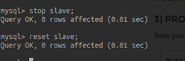
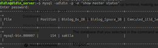

# Replikasi Pada MySQL

- [Replikasi Pada MySQL](#replikasi-pada-mysql)
  - [Deskripsi Tugas](#deskripsi-tugas)
  - [Dokumentasi Pengerjaan](#dokumentasi-pengerjaan)
    - [1. Menyiapkan Server](#1-menyiapkan-server)
      - [1a. Membuat Server Master](#1a-membuat-server-master)
      - [1b. Membuat Server Slave](#1b-membuat-server-slave)
    - [2. Konfigurasi Replikasi MySQL](#2-konfigurasi-replikasi-mysql)
      - [2a. Konfigurasi Master Node](#2a-konfigurasi-master-node)
      - [2b. Konfigurasi Slave Node](#2b-konfigurasi-slave-node)
    - [3. Pengujian Replikasi MySQL](#3-pengujian-replikasi-mysql)
    - [4. Promote slave as master](#4-promote-slave-as-master)
      - [4a. Pada Server Master Lama](#4a-pada-server-master-lama)
      - [4b. Pada Server Master Baru](#4b-pada-server-master-baru)
      - [4c. Pada Server Slave](#4c-pada-server-slave)

## Deskripsi Tugas
Tugas ini menerapkan konsep yang ada di Chapter 2 (RDBMS & Network Communication).

Yang harus dilakukan adalah:
1. Setup MySQL replication (1 master, n slave)
2. Eksekusi query pada master, contohnya import database Employee.
3. Cek proses replikasi pada slave
4. Proses recovery. Promote slave as master
5. Eksekusi query pada master yang baru.
6. Konfigurasi slave dari master yang lama.
7. Cek proses replikasi

## Dokumentasi Pengerjaan

### 1. Menyiapkan Server
* Jumlah server yang disiapkan sebanyak 5 buah server, terdiri atas:

  * 1 server **Master**
  * 4 server **Slave**

* Server Master dibuat dengan menggunakan **Ansible** dan server Slave dibuat dengan menggunakan **Vagrant Virtual Box**.
* Semua server menggunakan sistem operasi **Ubuntu 16.08**.
* Semua server diinstall mysql dengan menjalankan command:

  ```shell
  sudo apt-get install mysql-server mysql-client​
  ``` 
* Alamat IP server yang dibuat:
  
  * **Server Master**
    * Host: 10.151.36.210 (Server-id: 1)

  * **Server Slave**
    * Host: 10.151.36.196 (Server-id: 2)​
    * Host: 10.151.36.234 (Server-id: 3)​
    * Host: 10.151.36.235 (Server-id: 4)​
    * Host: 10.151.36.69 (Server-id: 5) 

* Gambar arsitektur server yang digunakan:
  
  
  
#### 1a. Membuat Server Master
#### 1b. Membuat Server Slave
> Prasyarat: Sudah menginstall **VirtualBox** dan **Vagrant**

1. Membuat folder baru, kemudian pindah ke dalam folder tersebut.
    ```shell
    mkdir bdt-2018
    cd bdt-2018
    ```
2. Inisialisasi vagrant.
    ```shell
    Vagrant init
    ```
    Setelah menjalankan perintah tersebut akan otomatis membuat file baru bernama **Vagrantfile**.
3. Mengedit isi **Vagrantfile** menjadi:
    ```shell
    Vagrant.configure("2") do |config|
      config.vm.box = "ubuntu/xenial64"

      config.vm.network "public_network", ip: "10.151.36.69"

      config.vm.provider "virtualbox" do |vb|
          vb.memory = "1024"
          vb.cpus = 2
      end

      config.vm.provision "shell", path: "provision.sh"
    end
    ```

    Keterangan:
    
    * Mengubah **config.vm.box** sesuai dengan box ubuntu yang akan digunakan. Sebelumnya unduh terlebih dahulu box tersebut dengan menjalankan `vagrant box add ubuntu/xenial64`.
    * **config.vm.network "public_network"** diuncomment dan diberikan alamat IP tertentu.
    * Menambahkan **vb.cpus** sebanyak 2
    * Menambahkan `config.vm.provision "shell", path: "provision.sh"` di paling akhir untuk menambahkan file provision yang akan dibahas pada langkah ke-4.
4. Membuat file **provision.sh** dengan menjalankan command `nano provision.sh` dan isi dengan:
    ```shell
    #!/usr/bin/env shell
    apt-get update

    # install mysql
    # export DEBIAN_FRONTEND=noninteractive
    debconf-set-selections <<< 'mysql-server mysql-server/root_password password kucinglucu'
    debconf-set-selections <<< 'mysql-server mysql-server/root_password_again password kucinglucu'
    apt-get install -y mysql-server
    apt-get install -y mysql-client mysql-common

    sudo service mysql restart
    ``` 
5. Menyalakan vagrant virtualbox dengan command `vagrant up`.
6. Melakukan provisioning aplikasi dengan menjalankan command `vagrant provision` atau `vagrant reload --provision`.
7. Masuk ke dalam vagrant dengan menjalankan command `vagrant ssh`.
8. Membuat user baru bebas dengan command `sudo adduser daus` dan membuat password supaya vagrant virtualbox bisa diakses dari luar menggunakan ssh.
    > Keterangan: "daus" adalah nama user yang dibuat.
9. Menambahkan user baru tersebut ke dalam **sudoer** dengan menjalankan command `sudo usermod -a -G sudo daus`.

### 2. Konfigurasi Replikasi MySQL
#### 2a. Konfigurasi Master Node
1. Membuka file konfigurasi MySQL.
    ```shell
    sudo nano /etc/mysql/mysql.conf.d/mysqld.cnf
    ```
2. Mengubah dan menambahkan konfigurasi berikut pada Master node.
    ```shell
    bind-address            = 0.0.0.0
    
    server-id               = 1
    log_bin                 = /var/log/mysql/mysql-bin.log
    binlog_do_db            = employees
    ```

    

    Keterangan:
    * **bind-address** diubah menjadi 0.0.0.0 pada semua host.
    * **server-id** diuncomment dan diberikan angka yang berbeda pada semua node server.
    * Menambahkan **log_bin** untuk mendefinisikan letak nyata dimana replikasi disimpan. Slave server akan menyalin semua perubahan yang terdaftar di log.
    * Menambahkan **binlog_do_db** untuk mendefinisikan nama database yang akan direplikasi.

3. Me-restart MySQL.
    ```shell
    sudo service mysql restart
    ```
4. Masuk ke dalam MySQL dengan username "root" dan password "kucinglucu".
    ```shell
    mysql -u root -p
    ***insert password***
    ```
5. Memberikan privilege (hak istimewa) kepada Slave untuk melakukan replikasi dan mengatur password-nya.
    ```shell
    GRANT REPLICATION SLAVE ON *.* TO 'slave_user'@'%' IDENTIFIED BY 'kucinglucu';
    ```
    > Keterangan: "kucinglucu" adalah password yang diatur.
    
    Kemudian dilanjutkan dengan 
    ```mysql
    FLUSH PRIVILEGES;
    ```
6. Membuat database baru bernama **employees**.
    ```mysql
    CREATE DATABASE employees;
    ```
    Masuk ke dalam database tersebut.
    ```mysql
    USE employees;
    ```
    > Database di download dari link berikut https://dev.mysql.com/doc/employee/en/
8. Mengunci database untuk mencegah perubahan yang masuk.
    ```mysql
    FLUSH TABLES WITH READ LOCK;
    ```
9. Melihat status master.
    ```mysql
    SHOW MASTER STATUS;
    ```
    Maka akan muncul tabel seperti di bawah ini:
    ```mysql
    mysql> SHOW MASTER STATUS;
    +------------------+----------+--------------+------------------+-------------------+
    | File             | Position | Binlog_Do_DB | Binlog_Ignore_DB | Executed_Gtid_Set |
    +------------------+----------+--------------+------------------+-------------------+
    | mysql-bin.000002 |      154 | employees    |                  |                   |
    +------------------+----------+--------------+------------------+-------------------+
    1 row in set (0.00 sec)
    ```
    > File dan Position wajib diingat-ingat untuk melakukan konfigurasi Slave nantinya

10. Membuka window terminal baru dan mengekspor database menggunakan **mysqldump**.
    ```shell
    mysqldump -u root -p --opt employees > employees.sql
    ```
11. Kembali ke window mysql yang sebelumnya dan membuka kunci database supaya database bisa menerima perubahan kembali.
    ```mysql
    UNLOCK TABLES;
    QUIT;
    ```

#### 2b. Konfigurasi Slave Node
1. Masuk ke dalam MySQL, membuat database baru, kemudian keluar.
    ```mysql
    mysql -u root -p
    ***insert password***

    CREATE DATABASE employees;
    EXIT;
    ```
2. Mengimpor database yang telah diekspor dari Master.
    ```mysql
    mysql -u root -p employees < /vagrant_data/employees.sql
    ```
3. Membuka file konfigurasi MySQL.
    ```shell
    sudo nano /etc/mysql/mysql.conf.d/mysqld.cnf
    ```
4. Mengubah dan menambahkan konfigurasi berikut pada Slave node.
    ```shell
    bind-address            = 0.0.0.0
    
    server-id               = 5
    relay-log               = /var/log/mysql/mysql-relay-bin.log
    log_bin                 = /var/log/mysql/mysql-bin.log
    binlog_do_db            = employees
    ```
    

    Keterangan:
    * **bind-address** diubah menjadi 0.0.0.0 pada semua host.
    * **server-id** diuncomment dan diberikan angka yang berbeda pada semua node server.
    * Menambahkan **log_bin** dan **relay-log**.
    * Menambahkan **binlog_do_db** untuk mendefinisikan nama database yang akan direplikasi.

4. Me-restart MySQL.
    ```shell
    sudo service mysql restart
    ```
6. Masuk ke dalam MySQL dan mendefinisikan parameter yang digunakan oleh server Slave agar bisa terhubung ke server Master.
    ```mysql
    CHANGE MASTER TO MASTER_HOST='10.151.36.210', MASTER_USER='slave1', MASTER_PASSWORD='kucinglucu', MASTER_LOG_FILE='mysql-bin.000002', MASTER_LOG_POS=154;
    ```
    Keterangan:
    * **MASTER_HOST** adalah IP host server Master yang telah disiapkan.
    * **MASTER_USER** adalah user MySQL yang telah diberikan privilege untuk mereplikasi data oleh server Master.
    * **MASTER_PASSWORD** adalah password yang telah di set.
    * **MASTER_LOG_FILE** dan **MASTER_LOG_POS** didapatkan dengan menjalankan `SHOW MASTER STATUS;` pada server master.
7. Mengaktifkan server Slave.
    ```mysql
    START SLAVE;
    ```
8. Melihat detail replikasi Slave.
    ```mysql
    SHOW SLAVE STATUS\G
    ```
    

### 3. Pengujian Proses Replikasi MySQL
  1. Untuk menguji replikasi sudah berjalan dapat diuji dengan menjalankan query pada node master. Contohnya menambah *record data* pada salah satu *table* dalam database.
  2. Pada node master, masuk ke database **employees** pada MySQL database
      ```bash
      mysql -uroot -p
      ***insert password***
      
      USE employees;
      SELECT * FROM departments;
      ```
      

  3. Tambahkan *record data* pada table **departments**
      ```bash
      INSERT INTO departments VALUES ('d010', 'Pembantu Umum');
      SELECT * from departments;
      ```
      

  4. Cek database pada slave, apakah isi table pada database node slave, sesuai dengan database pada node master.
    

### 4. Promote slave as master
#### 4a. Pada Server Master Lama
* Koneksi pada server master harus terputus terlebih dahulu, salah satu caranya adalah dengan mematikan layanan mysql pada server master.
* Pada server slave, jalankan perintah `SHOW SLAVE STATUS\G` untuk melihat status server slave:
* Jika pada kolom *Slave_SQL_Running_State* menampilkan *“Slave has read all relay log; waiting for more updates”*, maka server slave dapat di*promote* menjadi server master dengan cara me*reset* calon server master seperti berikut:
  ```mysql
  mysql> STOP SLAVE;
  Query OK, 0 rows affected (0.01 sec)

  mysql> RESET SLAVE;
  Query OK, 0 rows affected (0.01 sec)
  ```
  
#### 4b. Pada Server Master Baru
* Buka pengaturan mysql pada server master yang baru dengan cara:
  ```shell
  sudo nano /etc/mysql/mysql.conf.d/mysqld.cnf
  ```
* Lakukan perubahan pada kolom ```binlog_do_db``` menjadi `sakila`. Setelah itu lakukan simpan dan *refresh* pada MySQL dengan cara:
  ```shell
  sudo service mysql restart
  ```
* Buka MySQL shell pada server master yang baru. Jika *user* `slave1` tidak ada pada server master yang baru, maka lakukan:
  ```mysql
  GRANT REPLICATION SLAVE ON *.* TO 'slave1'@'%' IDENTIFIED BY 'kucinglucu';
  FLUSH PRIVILEGES;
  ```
* Kunci *database* untuk mencegah terjadinya perubahan dengan cara:
  ```mysql
  USE sakila;
  FLUSH TABLES WITH READ LOCK;
  ```
* Menampilkan status pada server master yang baru agar dapat mengetahui *file* dan *position*
  ```mysql
  SHOW MASTER STATUS;
  ```
  

* Ekspor *database* dengan menggunakan perintah berikut
  ```shell
  mysqldump -u root -p --opt sakila > sakila.sql
  ```
* Buka kembali *database* yang tadi telah dikunci pada server master yang baru dengan cara:
  ```mysql
  UNLOCK TABLES;
  QUIT;
  ```
#### 4c. Pada Server Slave
* Buat *database* baru bernama sakila pada server slave:
  ```mysql
  CREATE DATABASE sakila;
  EXIT;
  ```
* Impor *database* yang telah diekspor dan dikirim dari server master
  ```shell
  mysql -u root -p sakila < sakila.sql
  ```
* Buka pengaturan mysql pada server slave dengan cara:
  ```shell
  sudo nano /etc/mysql/mysql.conf.d/mysqld.cnf
  ```
* Lakukan perubahan pada kolom `binlog_do_db` menjadi `sakila`. Setelah itu lakukan simpan dan *refresh* pada MySQL dengan cara:
  ```shell
  sudo service mysql restart
  ```
* Buka kembali MySQL shell kembali dan lakukan perubahan konfigurasi server master yang terdapat pada MySQL server slave dengan cara:
  ```mysql
  CHANGE MASTER TO MASTER_HOST='10.151.36.196',MASTER_USER='slave1', MASTER_PASSWORD='kucinglucu', MASTER_LOG_FILE='mysql-bin.000001', MASTER_LOG_POS=  107;
  ```
* Aktifkan server slave:
  ```mysql
  START SLAVE;
  ```
* Menampilkan detail dari replikasi server slave dengan cara:
  ```mysql
  SHOW SLAVE STATUS\G
  ```
