### Basis Data Terdistribusi
# Aplikasi Web CRUD menggunakan Node.js, MongoDB, dan Vagrant Virtual Box
Oleh: **Hafara Firdausi (05111540000043)** - https://github.com/mocatfrio/bdt-2018/tree/master/Tugas-5

## Outline
- [Aplikasi Web CRUD menggunakan Node.js, MongoDB, dan Vagrant Virtual Box](#aplikasi-web-crud-menggunakan-nodejs-mongodb-dan-vagrant-virtual-box)
  - [Outline](#outline)
  - [1. Deskripsi Tugas](#1-deskripsi-tugas)
  - [2. Deskripsi Sistem](#2-deskripsi-sistem)
    - [2.1 Arsitektur Sistem](#21-arsitektur-sistem)
    - [2.2 MongoDB](#22-mongodb)
    - [2.3 Node.js](#23-nodejs)
    - [2.4 Dataset](#24-dataset)
  - [3. Implementasi Sistem](#3-implementasi-sistem)
    - [3.1 Persiapan](#31-persiapan)
    - [3.2 Modifikasi Script](#32-modifikasi-script)
    - [3.3 Aplikasi Web CRUD NodeJS](#33-aplikasi-web-crud-nodejs)
    - [3.4 Menjalankan Vagrant](#34-menjalankan-vagrant)
  - [4. Final Testing](#4-final-testing)
  - [5. Referensi](#5-referensi)

## 1. Deskripsi Tugas
Membuat Aplikasi Web CRUD (Create-Read-Update-Delete) menggunakan bahasa pemrograman bebas dan MongoDB Cluster.

Langkah yang harus dilakukan:
1. Membuat MongoDB cluster dengan 3 node.
2. Membuat aplikasi web CRUD yang memanfaatkan MongoDB cluster tersebut.
   *  Bahasa pemrograman bebas
   *  Menggunakan konsep OOP.
3. Memilih dataset yang akan dipakai.

## 2. Deskripsi Sistem 

### 2.1 Arsitektur Sistem

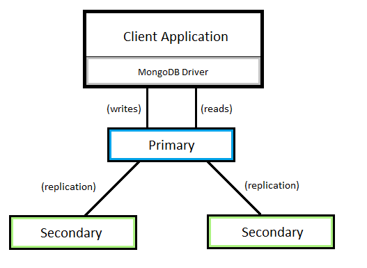

Sistem ini diimplementasikan dengan lingkungan virtual, yakni menggunakan teknologi **Vagrant** dan **Virtual Box**. 

**Deskripsi Host**
* Sistem Operasi : Ubuntu 14.04.5 LTS Trusty
* Versi Teknologi Virtualisasi yang digunakan :
  * Vagrant 2.0.4
  * Virtual Box 5.2.20r125813

**Deskripsi Node**
* Sistem Operasi : Ubuntu 16.04
* Aplikasi yang diinstall :
  * MongoDB : mongodb-org (Sebagai database. Diinstall di semua node)
  * Node.js : nodejs (Diinstall hanya di node master) 
  * NPM : npm (Sebagai Package Manager untuk Node.js. Diinstall hanya di node master)
  * PM2 : pm2 (Sebagai Process Manager untuk Node.js. Diinstall hanya di node master)

### 2.2 MongoDB
* Sistem ini memanfaatkan MongoDB Cluster sebagai database. 
* MongoDB adalah sebuah database dokumen yang open-source dan merupakan salah satu database NoSQL. 
* MongoDB memiliki fitur replikasi, yakni proses sinkronisasi data di beberapa server, yang disebut **ReplicaSet**. ReplicaSet adalah sekelompok/cluster server database MongoDB yang mengimplementasikan replikasi master-slave (primer-sekunder). 

### 2.3 Node.js
* Node.js adalah perangkat lunak yang didesain untuk mengembangkan aplikasi berbasis web dan ditulis dalam sintaks bahasa pemrograman JavaScript. 
* Saya memilih Node.js karena Node.js sangat sering disandingkan dengan MongoDB.

### 2.4 Dataset
* Dataset yang digunakan adalah Dataset Katalog Buku yang berisi 481 data. 
* Dataset diunduh di https://github.com/ozlerhakan/mongodb-json-files/blob/master/datasets/catalog.books.json dengan sedikit modifikasi pada bagian **"_id"**. Semua **"_id"** nya dihapus karena ada sebagian data yang tidak menggunakan **$oid** (object id).

## 3. Implementasi Sistem
### 3.1 Persiapan

* Mengunduh Vagrantfile MongoDB [mongodb.zip](https://drive.google.com/file/d/1GuPyLhooMYV-h6In_AW6OB_v52-sIsE4/view) yang telah disediakan oleh dosen, kemudian mengekstraknya (unzip) dengan cara:
  ```bash
  unzip mongodb.zip
  ```

  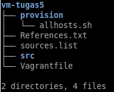

### 3.2 Modifikasi Script
Struktur folder Vagrant yang telah dimodifikasi:
```bash
.
├── provision
│   ├── allhosts.sh
│   └── nodejs.sh
├── sources.list
├── Vagrantfile
└── Web
    ├── app.js
    ├── config
    │   └── db.js
    ├── controllers
    │   └── bookController.js
    ├── models
    │   └── book.js
    ├── package.json
    ├── package-lock.json
    ├── public
    │   ├── css
    │   │   ├── all.min.css
    │   │   ├── bootstrap.min.css
    │   │   ├── custom.css
    │   │   └── webfonts
    │   │       ├── fa-brands-400.eot
    │   │       ├── fa-brands-400.svg
    │   │       ├── fa-brands-400.ttf
    │   │       ├── fa-brands-400.woff
    │   │       ├── fa-brands-400.woff2
    │   │       ├── fa-regular-400.eot
    │   │       ├── fa-regular-400.svg
    │   │       ├── fa-regular-400.ttf
    │   │       ├── fa-regular-400.woff
    │   │       ├── fa-regular-400.woff2
    │   │       ├── fa-solid-900.eot
    │   │       ├── fa-solid-900.svg
    │   │       ├── fa-solid-900.ttf
    │   │       ├── fa-solid-900.woff
    │   │       └── fa-solid-900.woff2
    │   ├── img
    │   │   └── brand.png
    │   └── js
    │       ├── all.min.js
    │       └── bootstrap.bundle.min.js
    ├── src
    │   ├── catalog.books.json
    │   └── mongod.conf
    └── views
        ├── book
        │   ├── add-book.ejs
        │   ├── edit-book.ejs
        │   └── list-book.ejs
        ├── components
        │   ├── footer.ejs
        │   ├── head.ejs
        │   └── navbar.ejs
        └── index.ejs
```
1. **Vagrantfile**

    ```ruby
    # -*- mode: ruby -*-
    # vi: set ft=ruby :

    # All Vagrant configuration is done below. The "2" in Vagrant.configure
    # configures the configuration version (we support older styles for
    # backwards compatibility). Please don't change it unless you know what
    # you're doing.

    Vagrant.configure("2") do |config|
      config.vm.define "db_manager" do |db_manager|
        db_manager.vm.hostname = "db-manager"
        db_manager.vm.box = "bento/ubuntu-16.04"
        db_manager.vm.network "private_network", ip: "192.168.33.10"
        db_manager.vm.network "public_network", bridge: "eth0"
        
        db_manager.vm.provider "virtualbox" do |vb|
          vb.name = "db-manager"
          vb.gui = false
          vb.memory = "512"
        end

        db_manager.vm.synced_folder "Web/", "/var/www/project",
          id: "vagrant-root",
          owner: "vagrant",
          group: "www-data",
          mount_options: ["dmode=775,fmode=664"]

        db_manager.vm.provision "shell", path: "provision/allhosts.sh", privileged: false
        db_manager.vm.provision "shell", path: "provision/nodejs.sh", privileged: false
      end

      config.vm.define "db_node1" do |db_node1|
        db_node1.vm.hostname = "db-node1"
        db_node1.vm.box = "bento/ubuntu-16.04"
        db_node1.vm.network "private_network", ip: "192.168.33.11"
        db_node1.vm.network "public_network", bridge: "eth0"
        
        db_node1.vm.provider "virtualbox" do |vb|
          vb.name = "db-node1"
          vb.gui = false
          vb.memory = "512"
        end

        db_node1.vm.synced_folder "Web/src/", "/var/www/project/src",
          id: "vagrant-root",
          owner: "vagrant",
          group: "www-data",
          mount_options: ["dmode=775,fmode=664"]

        db_node1.vm.provision "shell", path: "provision/allhosts.sh", privileged: false
      end

      config.vm.define "db_node2" do |db_node2|
        db_node2.vm.hostname = "db-node2"
        db_node2.vm.box = "bento/ubuntu-16.04"
        db_node2.vm.network "private_network", ip: "192.168.33.12"
        db_node2.vm.network "public_network", bridge: "eth0"
        
        db_node2.vm.provider "virtualbox" do |vb|
          vb.name = "db-node2"
          vb.gui = false
          vb.memory = "512"
        end

        db_node2.vm.synced_folder "Web/src/", "/var/www/project/src",
          id: "vagrant-root",
          owner: "vagrant",
          group: "www-data",
          mount_options: ["dmode=775,fmode=664"]

        db_node2.vm.provision "shell", path: "provision/allhosts.sh", privileged: false
      end

    end
    ```

    Modifikasi:
      * **bridge** pada `db_manager.vm.network "public_network", bridge: "eth0"` disesuaikan dengan host.
      * **vb.memory** disesuaikan dengan kondisi host supaya tidak lambat.
      * Menambahkan **vm.synced_folder** untuk mensinkronkan folder aplikasi web CRUD NodeJS yang telah dibuat.
      * Menambahkan `db_manager.vm.provision "shell", path: "provision/nodejs.sh", privileged: false` untuk menambahkan provisioning (persiapan) NodeJS khusus pada node **db_manager**.
      * Menambahkan **vm.synced_folder** pada kedua node secondary (**db_node1** dan **db_node2**)

2. **allhosts.sh**
  
    Disesuaikan dengan kebutuhan.
    
    ```bash
    # Declare host
    sudo bash -c \\"echo '192.168.33.10 db-manager' >> /etc/hosts\\"
    sudo bash -c \\"echo '192.168.33.11 db-node1' >> /etc/hosts\\"
    sudo bash -c \\"echo '192.168.33.12 db-node2' >> /etc/hosts\\"

    # Copy sources.list
    sudo cp '../sources.list' '/etc/apt/sources.list'

    # Install MongoDB

    # Step 1: Import the MongoDB public key
    sudo apt-key adv --keyserver hkp://keyserver.ubuntu.com:80 --recv 2930ADAE8CAF5059EE73BB4B58712A2291FA4AD5

    # Step 2: Generate a file with the MongoDB repository URL
    sudo bash -c \\"echo 'deb [ arch=amd64,arm64 ] https://repo.mongodb.org/apt/ubuntu xenial/mongodb-org/3.6 multiverse' | sudo tee /etc/apt/sources.list.d/mongodb-org-3.6.list\\"

    # Step 3: Refresh the local database with the packages
    sudo apt-get update

    # Step 4: Install the last stable MongoDB
    sudo apt-get install -y mongodb-org

    # Step 5: Enable MongoDB service
    sudo systemctl enable mongod    
    sudo systemctl start mongod

    # Step 6: Copy mongod.conf
    sudo bash -c \\"sudo cp /var/www/project/src/mongod.conf /etc/mongod.conf\\"
    sudo systemctl restart mongod
    ```
3. **nodejs.sh**
   
    Membuat sendiri sesuai kebutuhan.
   
    ```bash
    # Install NodeJS

    # Step 1: Install g++ and others needed
    sudo apt-get install gcc g++ make

    # Step 2: Download NodeJS + install nodejs dan npm
    curl -sL https://deb.nodesource.com/setup_0.12 | sudo bash -
    sudo apt-get install -y nodejs npm

    # Step 3: Install the project dependencies using NPM
    cd /var/www/project
    sudo npm install

    # Step 3: Install process manager untuk NodeJS + start pm2
    sudo npm install -g pm2
    sudo bash -c \\"sudo ln -s /usr/bin/nodejs /usr/bin/node\\"
    pm2 start /var/www/project/app.js
    ``` 
4. **mongod.conf**

    ```bash
    # mongod.conf

    # Where and how to store data.
    storage:
      dbPath: /var/lib/mongodb
      journal:
        enabled: true

    # where to write logging data.
    systemLog:
      destination: file
      logAppend: true
      path: /var/log/mongodb/mongod.log

    # network interfaces
    net:
      port: 27017
      bindIp: 0.0.0.0

    # how the process runs
    processManagement:
      timeZoneInfo: /usr/share/zoneinfo

    replication:
      replSetName: rs0
    ```

    Modifikasi:
      * **bindIp** diganti menjadi 0.0.0.0 supaya tidak tetap default 127.0.0.1
      * **replication:** diuncomment dan **replSetName** ditambahkan untuk memberikan nama replika set
  
### 3.3 Aplikasi Web CRUD NodeJS

Dapat dilihat di:
[Aplikasi Web CRUD Katalog Buku menggunakan NodeJS](vm-tugas5/Web) (Github)

### 3.4 Menjalankan Vagrant
1. Setelah memodifikasi script, maka jalankan vagrant virtual box
   
    ```bash
    vagrant up
    ```
    atau
    ```bash
    vagrant up --provision
    ```
    Ketika menjalankan vagrant, sebenarnya vagrant sedang melakukan provisioning (persiapan dan konfigurasi) menggunakan semua file di atas. Tunggu selama beberapa menit dan pastikan tidak ada error.

2. Cek apakah vagrant sudah berjalan dengan baik.
    ```bash
    vagrant status
    ```

3. Masuk ke dalam semua VM
   
    ```bash
    vagrant ssh db_manager
    vagrant ssh db_node1
    vagrant ssh db_node2
    ```
   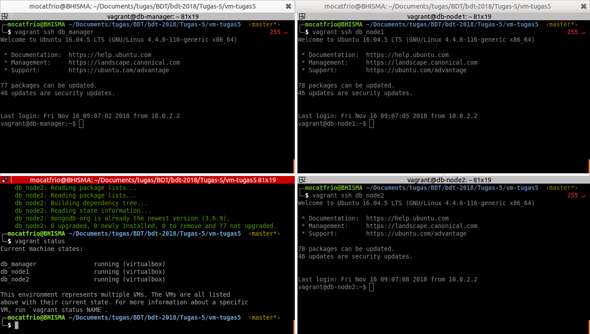

4. Setting MongoDB Replika Set pada **db_manager**. Replika Set adalah sebuah cluster server MongoDB yang mengimplementasikan replikasi master-slave (primary-secondary). Caranya:
    1. Masuk ke dalam shell mongo.
   
        ```bash
        mongo
        ```
    2. Lakukan inisialisasi replika set dengan menambahkan host **db-manager** sebagai member.
   
        ```mongo
        > rs.initiate()
        ```
        Jika keluar output seperti di bawah, maka inisialisasi berhasil.

        ```mongo
        {
          "info2" : "no configuration specified. Using a default configuration for the set",
          "me" : "db-manager:27017",
          "ok" : 1,
          "operationTime" : Timestamp(1542359495, 1),
          "$clusterTime" : {
            "clusterTime" : Timestamp(1542359495, 1),
            "signature" : {
              "hash" : BinData(0,"AAAAAAAAAAAAAAAAAAAAAAAAAAA="),
              "keyId" : NumberLong(0)
            }
          }
        }
        ```
    3. Lanjutkan dengan menambahkan host sisanya.
   
        ```mongo
        rs0:SECONDARY> rs.add('db-node1:27017')
        ```
        Jika keluar output seperti di bawah, maka inisialisasi berhasil.

        ```mongo
        {
          "ok" : 1,
          "operationTime" : Timestamp(1542360364, 1),
          "$clusterTime" : {
            "clusterTime" : Timestamp(1542360364, 1),
            "signature" : {
              "hash" : BinData(0,"AAAAAAAAAAAAAAAAAAAAAAAAAAA="),
              "keyId" : NumberLong(0)
            }
          }
        }
        ```
        dan

        ```mongo
        rs0:PRIMARY> rs.add('db-node2:27017')
        ```

        Jika keluar output seperti di bawah, maka inisialisasi berhasil.

        ```mongo
        {
          "ok" : 1,
          "operationTime" : Timestamp(1542361027, 1),
          "$clusterTime" : {
            "clusterTime" : Timestamp(1542361027, 1),
            "signature" : {
              "hash" : BinData(0,"AAAAAAAAAAAAAAAAAAAAAAAAAAA="),
              "keyId" : NumberLong(0)
            }
          }
        }
        ```
    4. Tes replika set.
        1. Pada **db_manager**
  
            ```mongo
            $ mongo
            rs0:PRIMARY> use exampleDB
            rs0:PRIMARY> for (var i = 0; i <= 10; i++) db.exampleCollection.insert( { x : i } )
            ```
        2. Pada **db_node1** dan **db_node2**
            
            ```mongo
            $ mongo
            rs0:SECONDARY> rs.slaveOk()
            rs0:SECONDARY> use exampleDB
            rs0:SECONDARY> db.exampleCollection.find()
            ```

        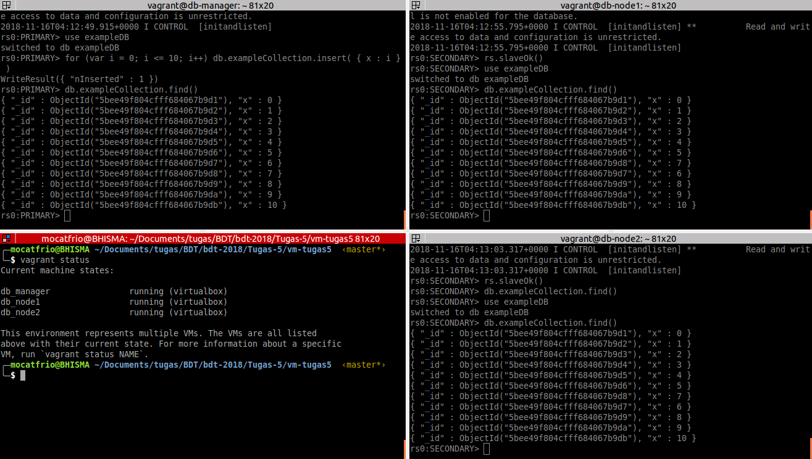

    5. Keluar dari shell mongo.

5. Import dataset katalog buku yang telah di download.
    ```bash
    mongoimport --db books --collection books --file /var/www/project/src/catalog.books.json --host=192.168.33.10:27017 --authenticationDatabase admin
    ```
6. Cek pada semua node, apakah data **books** telah terimpor dan tereplikasi dengan baik.
    * Cek isi data (Menggunakan command `db.'nama_collections'.find()`. Sebelumnya harus masuk ke mongo shell dan `use 'nama_database'`)
  
      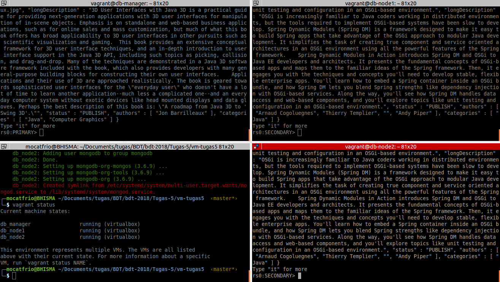
       
    * Cek jumlah data (Menggunakan command `db.'nama_collections'.count()`)
  
      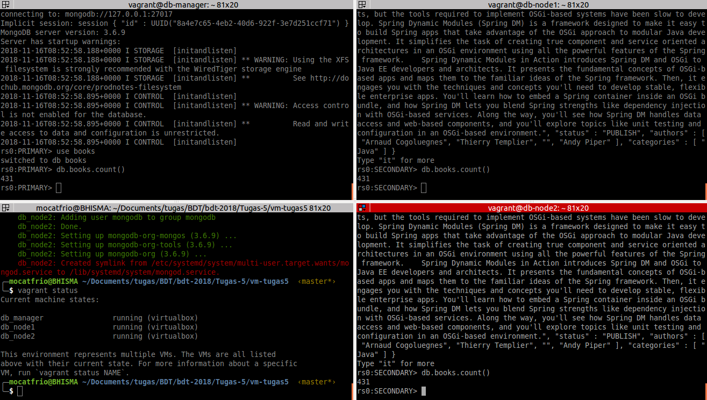

## 4. Final Testing
1. Ketik di browser `192.168.33.10:5000/book` atau klik **My Book** pada navbar, maka akan tampil halaman aplikasi web CRUD yang telah dibuat.
   
    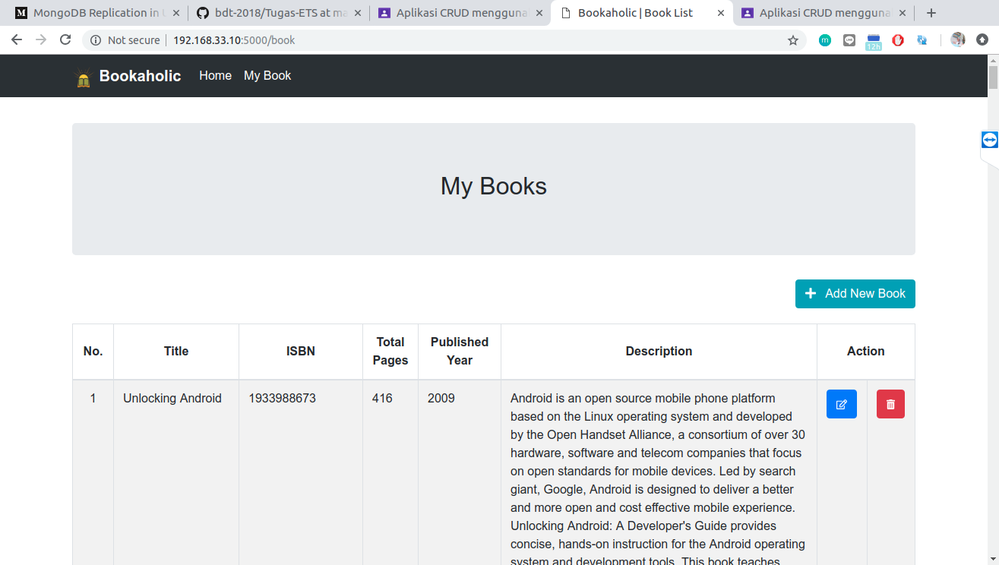

2. Tes Create (Menambahkan data)
    * Klik tombol **+ Add New Book**.
  
      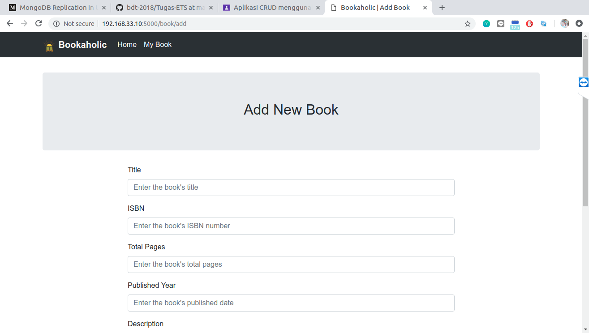

    * Isi form sesuai dengan keinginan. Klik Simpan.

      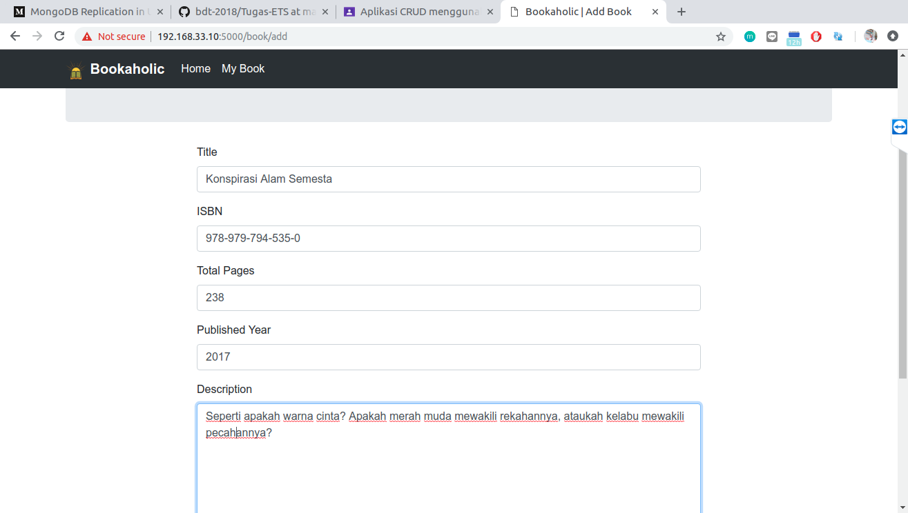

    * Cek pada tabel, apakah data buku baru telah tersimpan.

      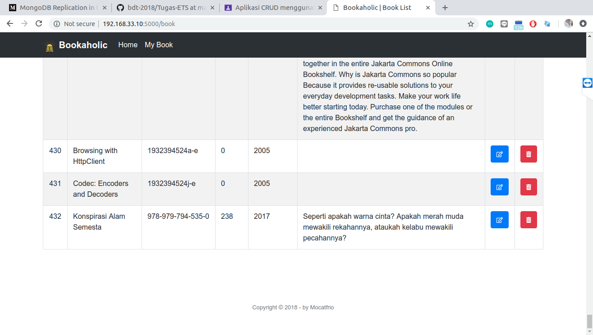

    * Cek pada masing-masing node, apakah data buku baru telah tereplikasi dengan baik. Gunakan command `db.books.findOne({})` atau sejenisnya.

     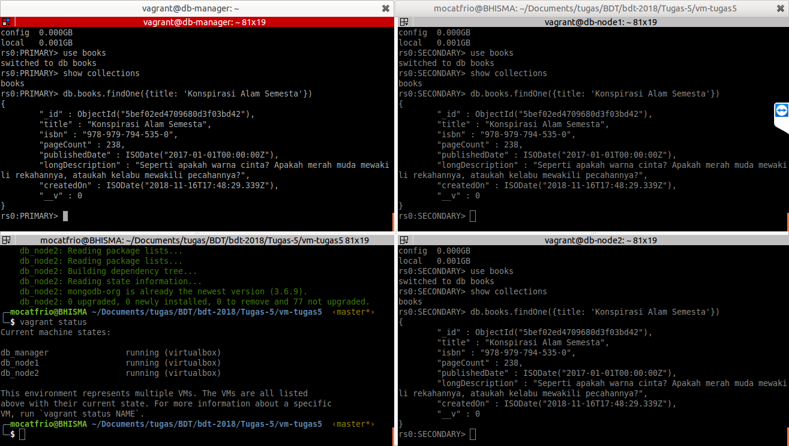

3. Tes Read (Menampilkan data)
   
    

4. Tes Update (Mengubah data)
    * Klik tombol **Edit** (gambar pensil) pada tabel **Action** di samping data buku yang ingin diubah. Pada kasus ini, saya mengubah judul buku.
   
      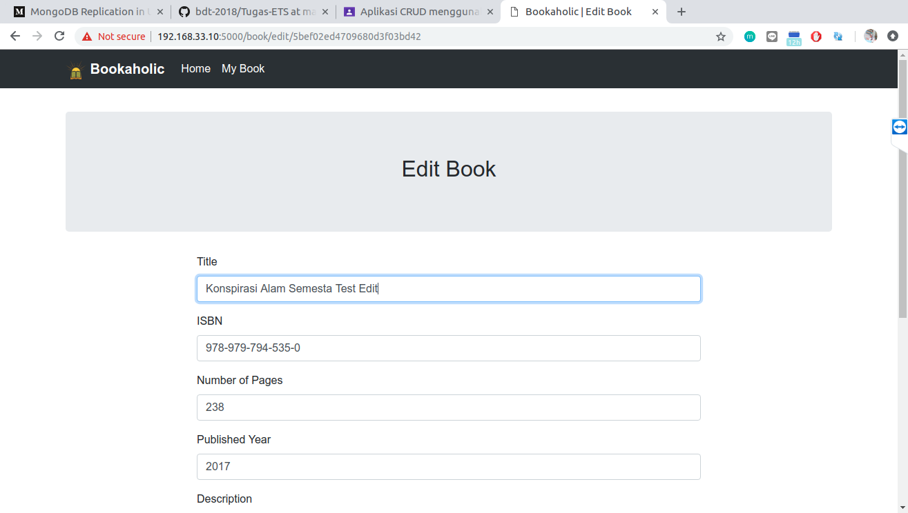

    * Cek pada tabel, apakah data buku berhasil terubah.

      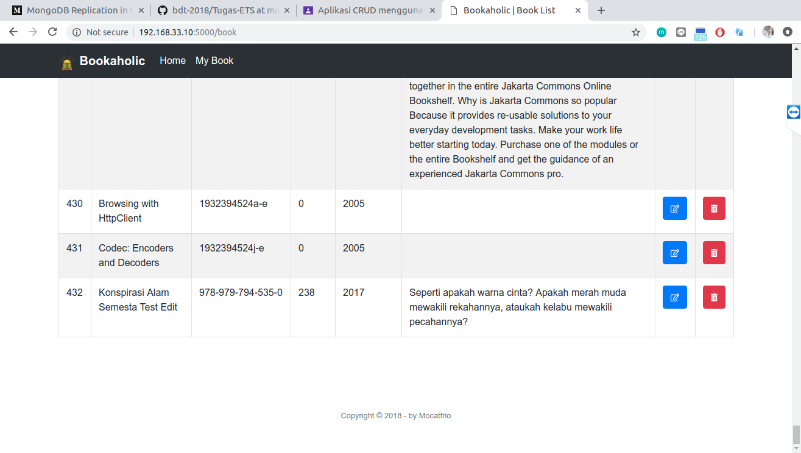

    * Cek pada masing-masing node, apakah data buku berhasil terubah di semua node. Gunakan command `db.books.findOne({})` atau sejenisnya. Jika semuanya berubah, maka fitur replikasi berjalan dengan baik.

      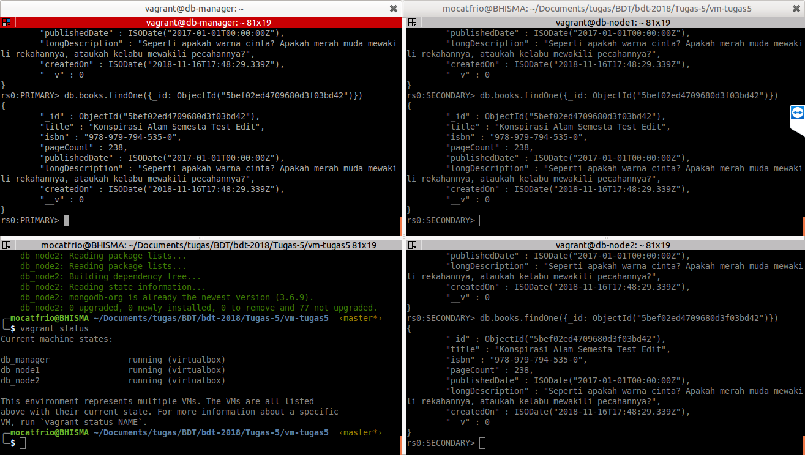

5. Tes Delete (Menghapus data)
    * Klik tombol **Delete** (gambar tong sampah) pada tabel **Action** di samping data buku yang ingin dihapus. Pada kasus ini, saya menghapus data buku "Konspirasi Alam Semesta".

      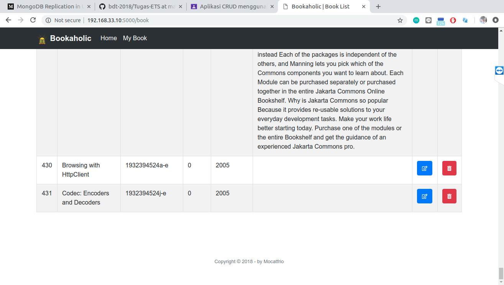
    
    * Cek pada masing-masing node, apakah data buku "Konspirasi Alam Semesta" berhasil terhapus di semua node. Gunakan command `db.books.findOne({})` atau sejenisnya. Jika data buku tidak ditemukan (null), maka fitur replikasi berjalan dengan baik.

      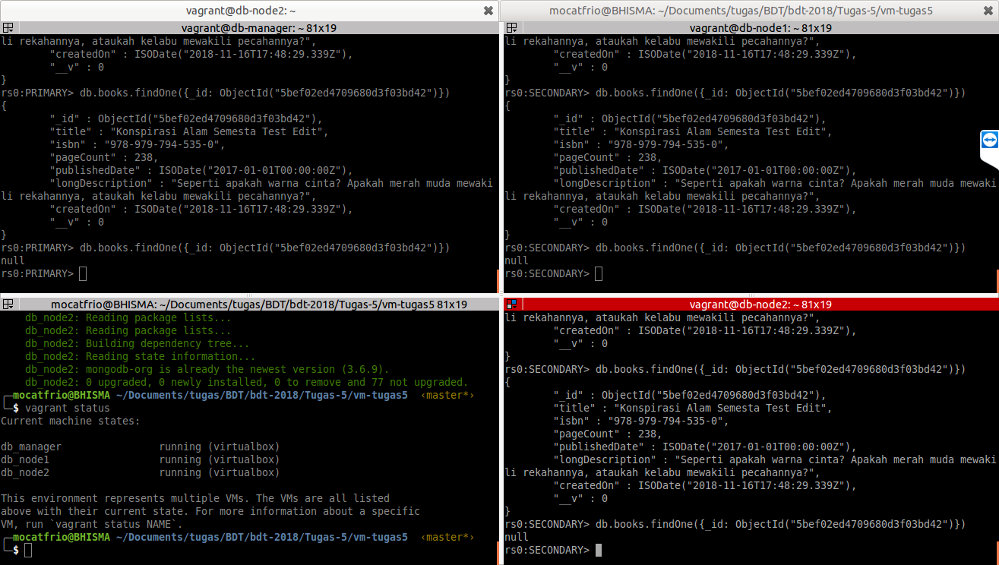

## 5. Referensi
* [MongoDB Cluster Installation](https://medium.com/@ratulbasak93/mongodb-relication-in-ubuntu-16-04-acd5baf744a3)
* [Building CRUD App with NodeJS and MongoDB](https://codeburst.io/writing-a-crud-app-with-node-js-and-mongodb-e0827cbbdafb)