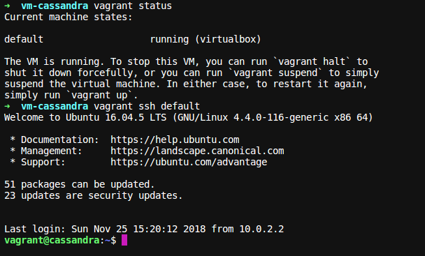
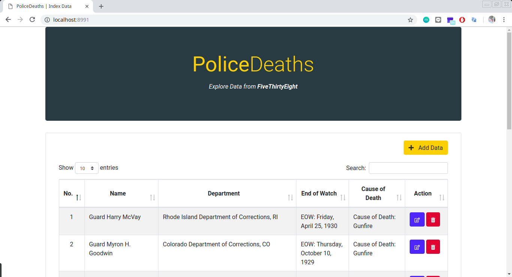
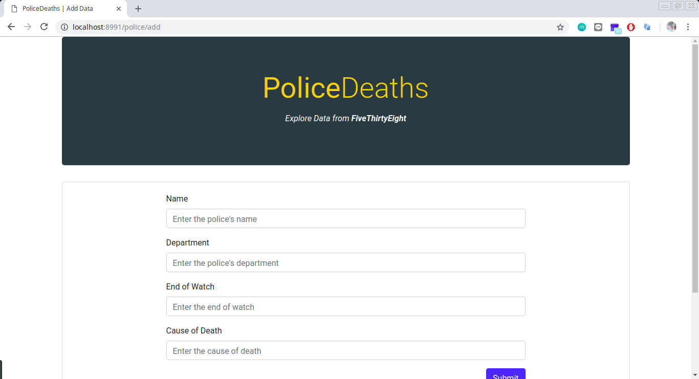
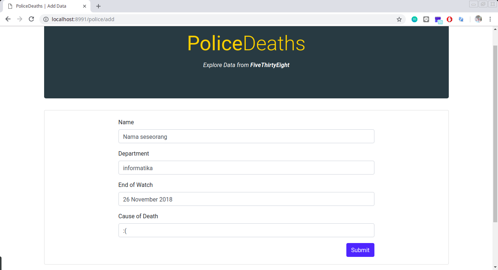
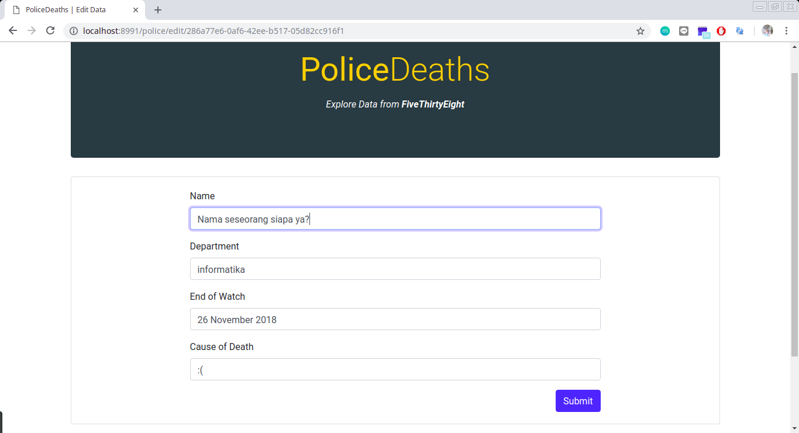
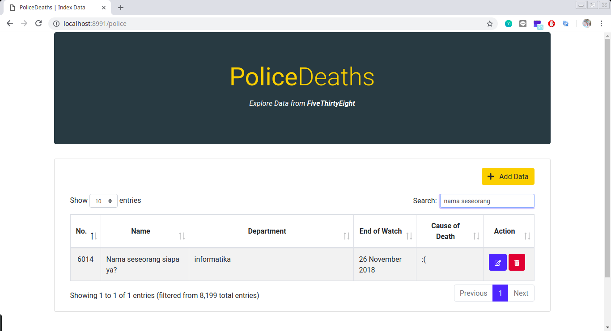
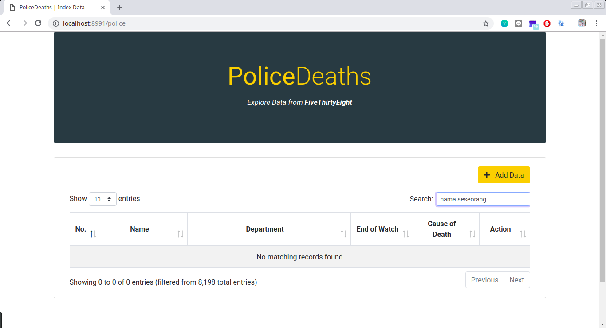

### Basis Data Terdistribusi
# Aplikasi Web CRUD menggunakan Flask dan Apache Cassandra
Oleh: **Hafara Firdausi (05111540000043)** - https://github.com/mocatfrio/bdt-2018/tree/master/Tugas-6

## Outline
  - [1. Deskripsi Tugas](#1-deskripsi-tugas)
  - [2. Deskripsi Sistem](#2-deskripsi-sistem)
    - [2.1 Deskripsi Host](#21-deskripsi-host)
    - [2.2 Deskripsi Node](#22-deskripsi-node)
    - [2.3 Deskripsi Dataset](#23-deskripsi-dataset)
    - [2.4 Deskripsi Web CRUD](#24-deskripsi-web-crud)
  - [3. Implementasi Sistem](#3-implementasi-sistem)
    - [3.1 Persiapan](#31-persiapan)
    - [3.2 Modifikasi Script Vagrant](#32-modifikasi-script-vagrant)
    - [3.3 Setting Cassandra Open-Connection](#33-setting-cassandra-open-connection)
    - [3.4 Menjalankan Vagrant](#34-menjalankan-vagrant)
    - [3.5 Import Dataset](#35-import-dataset)
    - [3.6 Membuat Aplikasi Web CRUD Flask](#36-membuat-aplikasi-web-crud-flask)
      - [3.6.1 Struktur Direktori Web CRUD FLASK](#361-struktur-direktori-web-crud-flask)
      - [3.6.2 Potongan Kode CRUD](#362-potongan-kode-crud)
  - [4. Testing CRUD](#4-testing-crud)
  - [5. Referensi](#5-referensi)

## 1. Deskripsi Tugas
1. Membuat sebuah single node Cassandra dari contoh konfigurasi yang diberikan.
2. Mengimpor data sample dalam bentuk .csv. Data sample dapat mengambil dari Kaggle yang berbentuk CSV. 
3. Membuat aplikasi web CRUD (Create, Read, Update, Delete) untuk mengolah data-data di atas. Tambahkan fitur 'Search Data' untuk mencari data di dalam tabel tersebut.

## 2. Deskripsi Sistem 

### 2.1 Deskripsi Host
* Sistem Operasi : Linux Mint 18.3 Sylvia
* Aplikasi yang digunakan :
  * Vagrant 2.0.2
  * Virtual Box 5.2.20r125813
  * Python 2.7.12
  * Pip 18.1

### 2.2 Deskripsi Node
Node diimplementasikan dengan teknologi virtualisasi menggunakan **Vagrant** dan **Virtual Box**.

* Sistem Operasi : Ubuntu 16.04
* Aplikasi yang diinstall :
  * Openjdk-8-jre
  * Cassandra

### 2.3 Deskripsi Dataset
* Dataset yang digunakan adalah Dataset Kematian Polisi berdasarkan FiveThirtyEight (dapat diunduh di https://www.kaggle.com/fivethirtyeight/fivethirtyeight-police-deaths-dataset) 
* Dataset berisi sekitar 22800 baris data
* Dataset memiliki 4 kolom atribut, yakni:
  * **person** (String) : Nama polisi yang meninggal
  * **dept** (String) : Asal departemen polisi yang meninggal
  * **eow** (String) : Kependekan dari "End of Watch", alias waktu kematian polisi
  * **cause** (String) : Penyebab kematian polisi
* Modifikasi dataset:
  * Jumlah data dikurangi menjadi 5000 data karena terlalu lambat pada saat query di web
  * Karena tidak ada kolom yang berperan sebagai Primary Key pada dataset, maka saya meng-generate sendiri kolom **id** (UUID) menggunakan script python. **id** nantinya akan menjadi Primary Key saat di-import ke Cassandra

### 2.4 Deskripsi Web CRUD
* Web dibuat menggunakan **Flask**, yakni kerangka kerja (framework) aplikasi web mikro yang ditulis dalam bahasa pemrograman Python
* Web dikembangkan menggunakan **Virtualenv** Python 2.7
* Web menggunakan library Python  **Flask-CQLAlchemy** dan **cassandra-driver** untuk menghubungkan web dengan Cassandra

## 3. Implementasi Sistem
### 3.1 Persiapan
* Mengunduh file Vagrantfile Cassandra [cassandra.zip](https://drive.google.com/file/d/1E3KNv-to-MoA8yVT5fuFyubE4Gnlliqx/view?usp=drive_open) yang telah disediakan oleh dosen, kemudian mengekstraknya (unzip) dengan cara:
  
  ```bash
  unzip cassandra.zip
  ```

### 3.2 Modifikasi Script Vagrant
Struktur folder Vagrant yang telah dimodifikasi:
```bash
.
├── provision/
│   ├── cassandra.yaml
│   ├── default.sh
│   ├── getid.py
│   ├── police_deaths.csv
│   ├── police_deaths_id-bak.csv
│   └── police_deaths_id.csv
├── sources.list
└── Vagrantfile
```
Script yang berperan penting dalam Vagrant adalah **Vagrantfile** dan script provisioning **default.sh**.

1. **Vagrantfile**

    ```ruby
    Vagrant.configure("2") do |config|
      config.vm.box = "bento/ubuntu-16.04"
      config.vm.hostname = "cassandra"
      config.vm.network "private_network", ip: "192.168.33.200"
      config.vm.network "public_network", bridge: "wlp3s0"

      config.vm.provider "virtualbox" do |vb|
        # Display the VirtualBox GUI when booting the machine
        vb.name = "cassandra"
        vb.gui = false
        # Customize the amount of memory on the VM:
        vb.memory = "1024"
      end

      config.vm.provision "shell", path: "provision/default.sh", privileged: false
    end
    ```

    Modifikasi:
      * **bridge** pada `config.vm.network "public_network"` diubah menjadi **wlp3s0** disesuaikan dengan interface host.
      * **vb.memory** dikurangi menjadi **1024** karena disesuaikan dengan kondisi host supaya tidak lambat.

2. **default.sh**
  
    Script provisioning disesuaikan dengan kebutuhan.
    
    ```bash
    #!/bin/bash

    # Referensi
    # https://www.vultr.com/docs/how-to-install-apache-cassandra-3-11-x-on-ubuntu-16-04-lts

    # sources.list diganti ke kambing.ui.ac.id agar lebih cepat saat download
    sudo cp '/vagrant/sources.list' '/etc/apt/sources.list'
    sudo apt-get update -y

    # Install Open JDK
    sudo apt-get install openjdk-8-jre -y

    # Set $JAVA_HOME di dalam /etc/profile
    sudo bash -c "echo 'JAVA_HOME=$(readlink -f /usr/bin/java | sed "s:bin/java::")'\\" | sudo tee -a /etc/profile
    # Reload environment variable
    source /etc/profile

    # Set repo Cassandra
    bash -c \\"echo 'deb http://www.apache.org/dist/cassandra/debian 311x main'\\" | sudo tee -a /etc/apt/sources.list.d/cassandra.sources.list
    curl https://www.apache.org/dist/cassandra/KEYS | sudo apt-key add -
    sudo apt-get update

    # Install dan menjalankan Cassandra
    sudo apt-get install cassandra -y
    sudo systemctl start cassandra
    sudo systemctl enable cassandra

    # Setting cassandra open-connection
    sudo cp '/vagrant/provision/cassandra.yaml' '/etc/cassandra/'
    sudo systemctl restart cassandra

    # Copy file csv 
    sudo cp '/vagrant/provision/police_deaths_id.csv' '/home/vagrant/'
    ```
    Modifikasi:
    * Menambahkan setting Cassandra open-connection
    * Meng-copy file CSV ke dalam `/home/vagrant`

### 3.3 Setting Cassandra Open-Connection
Karena aplikasi web dan database Cassandra berada pada host yang berbeda (Cassandra berada di host virtual), maka Cassandra harus di setting open-connection supaya bisa diakses dari luar host.

Caranya,
1. Buka file config **cassandra.yaml**
    ```bash
    nano /etc/cassandra/cassandra.yaml
    ```
2. Ubah parameter berikut
    ```bash
    start_rpc: true

    rpc_address: 0.0.0.0

    broadcast_rpc_address: [ip-node]

    listen_address: [ip-node]

    seed_provider:
        - seeds: "[ip-node]"
    ```
    **ip-node** = 192.168.33.200 (sesuai dengan IP privat yang diberikan pada node)

Cara diatas dapat dilakukan dengan cara langsung melakukan ssh pada vagrant `vagrant ssh <nama machine>`. Namun, supaya tidak terlalu lama, maka saya menambahkan langkah setting open-connection Cassandra pada saat provisioning. 

  ```bash
  # Setting cassandra open-connection
  sudo cp '/vagrant/provision/cassandra.yaml' '/etc/cassandra/'
  sudo systemctl restart cassandra
  ```

### 3.4 Menjalankan Vagrant
1. Setelah memodifikasi script, maka jalankan vagrant virtual box
   
    ```bash
    vagrant up
    ```
    atau

    ```bash
    vagrant reload --provision
    ```
    Ketika menjalankan vagrant, sebenarnya vagrant sedang melakukan provisioning (persiapan dan konfigurasi) menggunakan semua file di atas. Tunggu selama beberapa saat dan pastikan tidak ada error.

2. Cek apakah vagrant sudah berjalan dengan baik
   
    ```bash
    vagrant status
    ```

3. Masuk ke dalam VM
   
    ```bash
    vagrant ssh default
    ```
   

### 3.5 Import Dataset
Sebelum mengimport dataset, kita harus membuat **KEYSPACE** dan **TABLE** terlebih dahulu.

> Keterangan : CQL Commands lebih lengkap dapat dilihat di bagian referensi

1. Masuk ke dalam shell Cassandra
    ```bash
    vagrant@cassandra:~$ cqlsh

    Connected to Test Cluster at 127.0.0.1:9042.
    [cqlsh 5.0.1 | Cassandra 3.11.3 | CQL spec 3.4.4 | Native protocol v4]
    Use HELP for help.
    cqlsh>
    ```
2. Membuat **KEYSPACE** untuk single node Cassandra
    ```sql
    CREATE KEYSPACE police_deaths WITH REPLICATION = {
      'class' : 'SimpleStrategy',
      'replication_factor' : 1
    };
    ```
    Cek KEYSPACE yang sudah dibuat
    ```sql
    DESCRIBE KEYSPACES;
    ```
3. Membuat **TABLE** pada KEYSPACE yang sudah dibuat
    ```sql
    CREATE TABLE police_deaths.police (id UUID PRIMARY KEY, person text, dept text, eow text, cause text);
    ```
    atau bisa juga masuk terlebih dahulu ke KEYSPACE yang diinginkan
    ```sql
    USE police_deaths;
    
    CREATE TABLE police (id UUID PRIMARY KEY, person text, dept text, eow text, cause text);
    ```
4. Import dataset police death CSV yang telah ter-copy ke `/home/vagrant`
    ```sql
    COPY police_deaths.police (id, person, dept, eow, cause) FROM 'police_deaths_id.csv' WITH DELIMITER=',' AND HEADER=TRUE;
    ```

    Pastikan outputnya berhasil
    ```bash
    Processed: 8199 rows; Rate:    1627 rows/s; Avg. rate:    2239 rows/s
    8199 rows imported from 1 files in 3.662 seconds (0 skipped).
    ```

5. Setelah dataset ter-impor, kita bebas mengeksplor CQL commands Cassandra, misalnya: 
    * Cek data **police**
      ```sql
      SELECT * FROM police_deaths.police LIMIT 10;
      ```
    * Cek jumlah data **police**
      ```sql
      SELECT COUNT(id) FROM police_deaths.police;
      ```
    * dsb.

### 3.6 Membuat Aplikasi Web CRUD Flask
Ketika kita sedang mengembangkan sebuah aplikasi Python, lebih baik menggunakan **Virtualenv** supaya tidak mempengaruhi environment global.

> Keterangan : Pastikan sudah menginstall Python, Pip, dan Virtualenv

1. Membuat dan berpindah ke direktori project **flask-crud-app**
   ```bash
   mkdir flask-crud-app
   cd flask-crud-app
   ```
   
2. Membuat **Virtualenv**
    ```bash
    virtualenv -p python2 venv
    ```
    Mengaktifkan Virtualenv
    ```bash
    source venv/bin/activate
    ```
    Menonaktifkan Virtualenv
    ```bash
    deactivate
    ```

3. Inisialisasi project dengan menginstall Flask (pastikan sudah masuk ke Virtualenv)
    ```bash
    pip install Flask
    ```

4. Menginstall library-library Python yang dibutuhkan. Kemudian catat ke sebuah file **requirements.txt**
    ```bash
    pip freeze > requirements.txt
    ```

#### 3.6.1 Struktur Direktori Web CRUD FLASK

```bash
├── flask-crud-app/
    ├── app/
    │   ├── __init__.py
    │   ├── config.py
    │   ├── models.py
    │   ├── static/
    │   │   ├── css/
    │   │   ├── img/
    │   │   └── js/
    │   ├── templates/
    │   │   ├── add.html
    │   │   ├── edit.html
    │   │   ├── index.html
    │   │   └── main.html
    │   └── views.py
    ├── manage.py
    ├── requirements.txt
    └── venv/
```
Keterangan:
* **manage.py** : File titik masuk aplikasi, yakni berguna untuk menjalankan keseluruhan aplikasi. Kita hanya perlu memanggil file ini, dengan command: 
    ```bash
    python manage.py runserver
    ```
    Output:
    ```bash
    * Serving Flask app "app" (lazy loading)
    * Environment: production
      WARNING: Do not use the development server in a production environment.
      Use a production WSGI server instead.
    * Debug mode: on
    * Running on http://0.0.0.0:8991/ (Press CTRL+C to quit)
    * Restarting with stat
    * Debugger is active!
    * Debugger PIN: 962-976-676
    ```
    
    Alangkah baiknya untuk mengaktifkan **DEBUG** seperti diatas ketika sedang mengembangkan aplikasi
* **requirements.txt** : File yang menyimpan semua library Python yang dibutuhkan untuk diinstall. Jika ingin menginstall hanya perlu menggunakan command:
    ```bash
    pip install -r requirements.txt
    ```
* **app/__init\__.py** : File yang menginisialisasi modul Python. Tanpa file ini, Python tidak akan mengenali direktori ini sebagai modul
* **app/config.py** : File yang berisi konfigurasi, termasuk konfigurasi database Cassandra
* **app/models.py** : File yang mendefinisikan Model. Model adalah yang merepresentasikan tabel database di dalam kode
* **app/views.py** : File yang mengatur routes
* **app/templates** : Direktori yang menyimpan file HTML (front-end)
* **app/static** : Direktori yang menyimpan file static, seperti JS, CSS dan IMAGE

#### 3.6.2 Potongan Kode CRUD
1. Koneksi dengan database Cassandra
    * **app/config.py**
      ```python
      CASSANDRA_HOSTS = ['192.168.33.200']
      CASSANDRA_KEYSPACE = "police_deaths"
      ```
    * **app/__init\__.py**
      ```python
      from flask_cqlalchemy import CQLAlchemy
      from config import CASSANDRA_HOSTS, CASSANDRA_KEYSPACE

      app.config['CASSANDRA_HOSTS'] = CASSANDRA_HOSTS
      app.config['CASSANDRA_KEYSPACE'] = CASSANDRA_KEYSPACE

      db = CQLAlchemy(app)
      ```
    
2. Mendefinisikan Model
    * **app/models.py**
      ```python
      class Police(db.Model):
        __keyspace__ = 'police_deaths'
        id = db.columns.UUID(primary_key=True, default=uuid.uuid4)
        person = db.columns.Text() 
        dept = db.columns.Text()
        eow = db.columns.Text()
        cause = db.columns.Text()
      ```
3. Menambahkan data (Create)
    * **app/views.py**
      ```python
      @app.route("/police/add", methods=['GET', 'POST'])
      def add():
        # if request GET, return add form page
        if request.method == 'GET':
          return render_template("add.html", title = "Add Data")

        # if request POST, retrieve data from add form, and save to Cassandra database
        else :
          person = request.form.get('name')
          dept = request.form.get('dept')
          eow = request.form.get('eow')
          cause = request.form.get('cod')

          polices = Police.create(
            person = person,
            dept = dept,
            eow = eow,
            cause = cause,
          )

          return redirect ( url_for('index') )
      ```
4. Menampilkan data (Read)
    * **app/views.py**
      ```python
      @app.route("/")
      @app.route("/police")
      def index():
        polices = Police.objects().all()
        return render_template("index.html", title = "Index Data", polices = polices)
      ```
5. Mengedit data (Edit)
    * **app/views.py**
      ```python
      @app.route("/police/edit/<id>", methods=['GET', 'POST'])
      def edit(id):
        # if request GET, return edit form page
        if request.method == 'GET':
          police = Police.objects().get(id = id)

          return render_template("edit.html", title = "Edit Data", police = police)

        # if request POST, retrieve data from edit form, and save to Cassandra database
        else :
          police = Police.objects().get(id = id)

          person = request.form.get('name')
          dept = request.form.get('dept')
          eow = request.form.get('eow')
          cause = request.form.get('cod')

          police.update(
            person = person,
            dept = dept,
            eow = eow,
            cause = cause,
          )

          return redirect ( url_for('index') )
      ```
6. Menghapus data (Delete)
    * **app/views.py**
      ```python
      @app.route('/police/delete/<id>', methods=['POST'])
      def delete(id):
        police = Police.objects().get(id = id)
        police.delete()

        return redirect ( url_for('index') )
      ```
7. Manage server
    * **manage.py**
      ```python
      manager = Manager(app)

      manager.add_command("runserver", Server(
          use_debugger = True,
          use_reloader = True,
          host = '0.0.0.0',
          port = '8991')
      )
      ```

## 4. Testing CRUD
1. Nyalakan server web Flask
    ```bash
    python manage.py runserver
    ```
2. Ketik di browser `localhost:8991` 
   
    

3. Tes Create (Menambahkan data)
    * Klik tombol **+ Add Data**.
  
      

    * Isi form sesuai dengan keinginan, kemudian klik tombol **Submit**

      

    * Cek pada tabel, apakah data telah tersimpan dengan menggunakan fitur "Search"

      

4. Tes Read (Menampilkan data)
   
    

5. Tes Update (Mengubah data)
    * Klik tombol **Edit** (icon pensil) pada tabel **Action** di samping data yang ingin diubah. Pada kasus ini, saya mengubah nama. Kemudian klik tombol **Submit**
   
      

    * Cek pada tabel, apakah data buku berhasil terubah dengan menggunakan fitur "Search"

      

6. Tes Delete (Menghapus data)
    * Klik tombol **Delete** (icon tong sampah) pada tabel **Action** di samping data yang ingin dihapus. Pada kasus ini, saya menghapus data "Nama seseorang siapa ya?".
    * Cek pada tabel, apakah data berhasil terhapus dengan menggunakan fitur "Search"

      

## 5. Referensi
* [CQL Commands](https://docs.datastax.com/en/cql/3.3/cql/cql_reference/cqlCommandsTOC.html)
* [Getting Started With Flask, A Python Microframework](https://scotch.io/tutorials/getting-started-with-flask-a-python-microframework)
* [Apache Cassandra And Python Step By Step Guide With Example](https://techfossguru.com/apache-cassandra-python-step-step-guide-ubuntu-example/)
* [Creating a tumblelog with Flask and Flask-CQLAlchemy](http://thegeorgeous.com/2015/06/17/creating-a-tumblelog-with-flask-and-flask-cqlalchemy-I.html)
* [cassandra.cqlengine.models - Table models for object mapping](http://datastax.github.io/python-driver/api/cassandra/cqlengine/models.html)