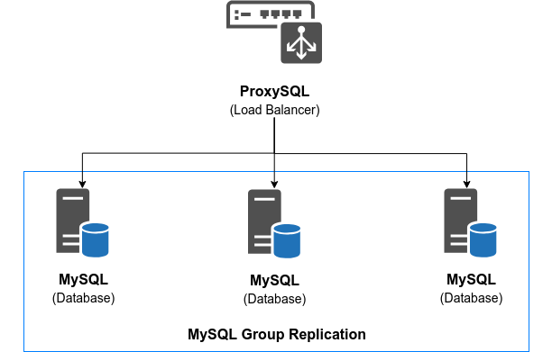
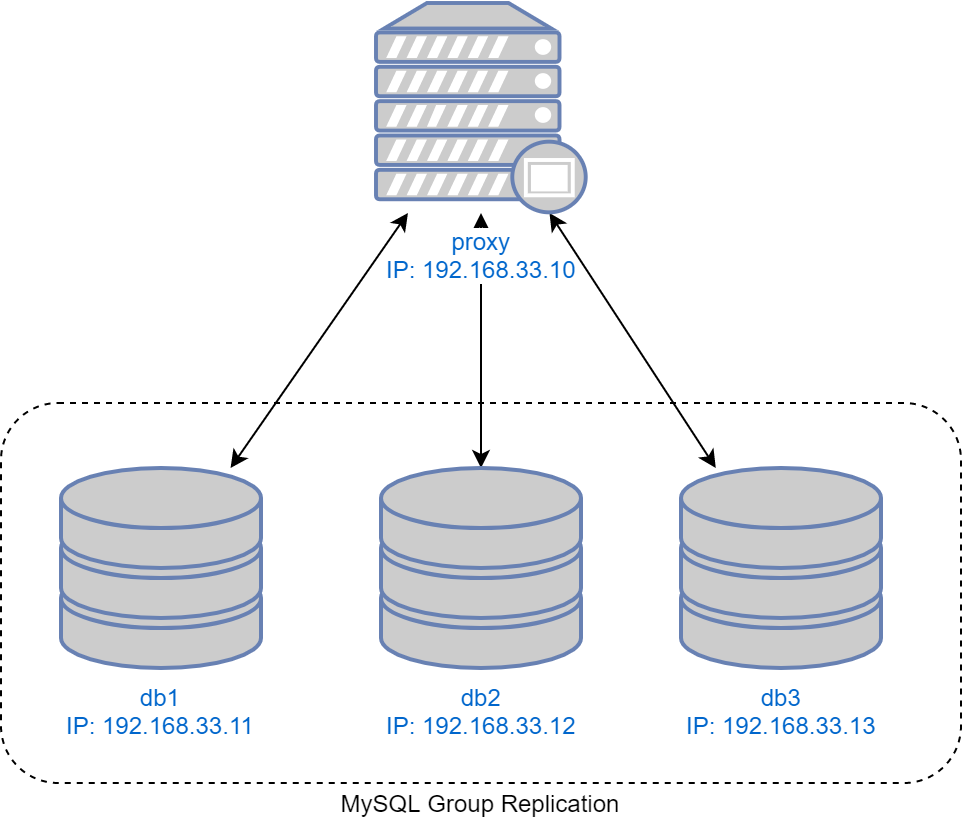

### Tugas 3 Basis Data Terdistribusi
# Implementasi Parallel DBMS
Oleh: **Hafara Firdausi (05111540000043)**
https://github.com/mocatfrio/bdt-2018/tree/master/Tugas-3

## Outline
- [Implementasi Parallel DBMS](#implementasi-parallel-dbms)
    - [Outline](#outline)
    - [1. Deskripsi Tugas](#1-deskripsi-tugas)
        - [1.1 Tujuan](#11-tujuan)
    - [2. Deskripsi Sistem](#2-deskripsi-sistem)
        - [2.1 Arsitektur Sistem](#21-arsitektur-sistem)
        - [2.2 Komponen Sistem](#22-komponen-sistem)
        - [2.2.1 Server Database](#221-server-database)
        - [2.2.1 Server ProxySQL sebagai Load Balancer](#221-server-proxysql-sebagai-load-balancer)
    - [Referensi](#referensi)

## 1. Deskripsi Tugas
Mengimplementasikan Parallel DBMS dengan langkah-langkah sebagai berikut:
1. Membuat:
   * 1 Node ProxySQL Server + LAMPP stack
   * 3 Node MySQL Group Replication Database
   
    

2. Menginstall CMS (Wordpress) di ProxySQL Server
3. Melakukan simulasi proses replikasi basis data dan high availability:
    * Tes dengan cara mematikan salah satu server database
    * Pastikan data yang ada selalu tereplikasi ke node yang lain

### 1.1 Tujuan

* Membuat server basis data terdistribusi dengan menggunakan konsep group replication.
* Mampu menambahkan **load balancer (ProxySQL)** untuk membagi request ke server basis data.
* Menambahkan aplikasi **CMS (Wordpress)** yang memanfaatkan arsitektur tersebut.
* Menguji kehandalan sistem (testing) dengan menyimulasikan matinya beberapa node dan menunjukkan bahwa data tetap tereplikasi pada node-node server basis data.

## 2. Deskripsi Sistem

### 2.1 Arsitektur Sistem

Sistem ini diimplementasikan dengan virtualisasi, yakni menggunakan teknologi **Vagrant**.

### 2.2 Komponen Sistem
### 2.2.1 Server Database
Pada sistem ini terdapat 3 server sebagai database, yakni **db1**, **db2**, dan **db3**.
* Sistem operasi : Ubuntu 16.04
* MySQL Server menggunakan community edition yang support group replication.
    * mysql-common_5.7.23
    * mysql-community-client_5.7.23
    * mysql-client_5.7.23
    * mysql-community-server_5.7.23
* Konfigurasi basis data:
    * **cluster_bootstrap.sql**: Melakukan bootstrapping MySQL group replication
    * **cluster_member.sql**: Melakukan konfigurasi group replication pada node yang lain
    * **addition_to_sys.sql**: patch script untuk ProxySQL
    * **create_proxysql_user.sql**: create user untuk ProxySQL (‘monitor’ untuk monitoring, ‘playgrounduser’ untuk contoh aplikasi)

### 2.2.1 Server ProxySQL sebagai Load Balancer
* Sistem operasi : Ubuntu 16.04
* MySQL Client :
    * mysql-common_5.7.23
    * mysql-community-client_5.7.23
    * mysql-client_5.7.23
* Konfigurasi basis data:
    * **proxysql.sql**: mengubah user admin ProxySQL, menambahkan user ‘monitoring’, menambahkan node MySQL, menambahkan user ‘playground’

## Referensi
* https://www.digitalocean.com/community/tutorials/how-to-configure-mysql-group-replication-on-ubuntu-16-04
* https://www.digitalocean.com/community/tutorials/how-to-use-proxysql-as-a-load-balancer-for-mysql-on-ubuntu-16-04#step-8-%E2%80%94-verifying-the-proxysql-configuration