### Tugas 3 Basis Data Terdistribusi
# Implementasi Parallel DBMS
Oleh: **Hafara Firdausi (05111540000043)**
https://github.com/mocatfrio/bdt-2018/tree/master/Tugas-3

## Outline
- [Implementasi Parallel DBMS](#implementasi-parallel-dbms)
    - [Outline](#outline)
    - [1. Deskripsi Tugas](#1-deskripsi-tugas)
        - [1.1 Tujuan](#11-tujuan)
    - [2. Deskripsi Sistem](#2-deskripsi-sistem)
        - [2.1 Arsitektur Sistem](#21-arsitektur-sistem)
        - [2.2 Komponen Sistem](#22-komponen-sistem)
            - [2.2.1 MySQL Group Replication Server sebagai Database](#221-mysql-group-replication-server-sebagai-database)
            - [2.2.2 ProxySQL Server sebagai Load Balancer](#222-proxysql-server-sebagai-load-balancer)
    - [3. Implementasi Sistem](#3-implementasi-sistem)
        - [3.1 Persiapan](#31-persiapan)
        - [3.2 Langkah Implementasi](#32-langkah-implementasi)
            - [3.2.1 Modifikasi File](#321-modifikasi-file)
            - [3.2.2 Menjalankan Vagrant](#322-menjalankan-vagrant)
            - [3.2.3 Konfigurasi Wordpress](#323-konfigurasi-wordpress)
    - [4. Testing](#4-testing)
        - [4.1 Tes Koneksi](#41-tes-koneksi)
        - [4.2 Tes Replikasi dan High Availibility](#42-tes-replikasi-dan-high-availibility)
    - [5. Referensi](#5-referensi)

## 1. Deskripsi Tugas
Mengimplementasikan Parallel DBMS menggunakan ProxySQL dan MySQL Group Replication
1. Membuat:
   * 1 Node ProxySQL + LAMPP stack sebagai load balancer sekaligus web server
   * 3 Node MySQL Group Replication sebagai server database
   
    

2. Menginstall:
   * Web Server Stack (Apache, PHP)
   * CMS (Wordpress) di ProxySQL Server
3. Melakukan simulasi proses replikasi basis data dan high availability, dengan cara:
    * Mematikan salah satu server database
    * Pastikan data yang ada selalu tereplikasi ke node yang lain

### 1.1 Tujuan

Pada tugas ini, mahasiswa diharapkan mampu untuk:
* Membuat **server basis data terdistribusi** dengan menggunakan konsep **group replication**.
* Mampu menambahkan **load balancer (ProxySQL)** untuk membagi request ke server basis data.
* Menambahkan aplikasi **CMS (Wordpress)** yang memanfaatkan arsitektur tersebut.
* Menguji kehandalan sistem (testing) dengan **menyimulasikan matinya beberapa node** dan menunjukkan bahwa **data tetap tereplikasi** pada node-node server basis data.

## 2. Deskripsi Sistem

### 2.1 Arsitektur Sistem


Sistem ini diimplementasikan dengan lingkungan virtual, yakni menggunakan teknologi **Vagrant** dan **Virtual Box**.

### 2.2 Komponen Sistem
#### 2.2.1 MySQL Group Replication Server sebagai Database
* Sistem operasi : Ubuntu 16.04
* Teknologi : MySQL Server 
  Menggunakan community edition yang support group replication:
    * mysql-common_5.7.23
    * mysql-community-client_5.7.23
    * mysql-client_5.7.23
    * mysql-community-server_5.7.23
* File konfigurasi basis data
    * **cluster_bootstrap.sql** : Melakukan bootstrapping MySQL group replication (hanya dilakukan pada salah satu db server saja)
    * **cluster_member.sql** : Melakukan konfigurasi MySQL group replication pada node db yang lain (node member)
    * **addition_to_sys.sql** : Patch script untuk ProxySQL
    * **create_proxysql_user.sql** : Create user untuk ProxySQL (‘monitor’ untuk monitoring, ‘playgrounduser’ untuk contoh aplikasi)
* Host virtual beserta alamat IPnya
    * **db1** : 192.168.33.11 
    * **db2** : 192.168.33.12
    * **db3** : 192.168.33.13

#### 2.2.2 ProxySQL Server sebagai Load Balancer
* Sistem operasi : Ubuntu 16.04
* Teknologi : MySQL Client
    * mysql-common_5.7.23
    * mysql-community-client_5.7.23
    * mysql-client_5.7.23
* Konfigurasi basis data
    * **proxysql.sql**: Mengubah user admin ProxySQL, menambahkan user ‘monitoring’, menambahkan node MySQL, menambahkan user ‘playground’
* Host virtual beserta alamat IPnya
    * **proxy** : 192.168.33.10

## 3. Implementasi Sistem
### 3.1 Persiapan
* Lingkungan host : Ubuntu 18.04.1 LTS
* Aplikasi yang harus diinstall :
    * Vagrant (versi 2.0.2)
    * Virtual Box (versi 5.2.10_Ubuntur121806)
* Mendownload [mysql-cluster-proxysql.zip](https://drive.google.com/open?id=12ojGu1Sss8ka9N9-K8zOigwb7gBAmtCE&authuser=0) yang telah disediakan oleh dosen, kemudian mengekstraknya (unzip) dengan cara:
    ```bash
    unzip mysql-cluster-proxysql.zip
    ```

    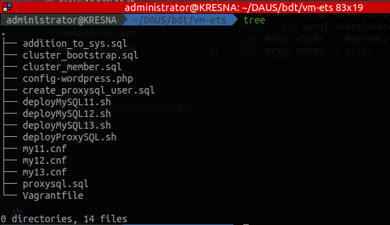

### 3.2 Langkah Implementasi
#### 3.2.1 Modifikasi File
Ada beberapa file yang dimodifikasi:
1. **Vagrantfile**

    ```ruby
    # -*- mode: ruby -*-
    # vi: set ft=ruby :

    # All Vagrant configuration is done below. The "2" in Vagrant.configure
    # configures the configuration version (we support older styles for
    # backwards compatibility). Please don't change it unless you know what
    # you're doing.

    Vagrant.configure("2") do |config|
    
        # MySQL Cluster dengan 3 node
        (1..3).each do |i|
            config.vm.define "db#{i}" do |node|
            node.vm.hostname = "db#{i}"
            node.vm.box = "bento/ubuntu-16.04"
            node.vm.network "private_network", ip: "192.168.33.1#{i}"
            node.vm.network "public_network", bridge: "enp5s0"
            
            node.vm.provider "virtualbox" do |vb|
                vb.name = "db#{i}"
                vb.gui = false
                vb.memory = "512"
            end
        
            node.vm.provision "shell", path: "deployMySQL1#{i}.sh", privileged: false
            end
        end

        config.vm.define "proxy" do |proxy|
            proxy.vm.hostname = "proxy"
            proxy.vm.box = "bento/ubuntu-16.04"
            proxy.vm.network "private_network", ip: "192.168.33.10"
            proxy.vm.network "public_network",  bridge: "enp5s0"
            
            proxy.vm.provider "virtualbox" do |vb|
                vb.name = "proxy"
                vb.gui = false
                vb.memory = "512"
            end

            proxy.vm.provision "shell", path: "deployProxySQL.sh", privileged: false
        end

    end
    ```
    Modifikasi :
    * Mengubah `bridge` pada `proxy.vm.network` menjadi `enp5s0` untuk menyesuaikan dengan interface yang digunakan oleh host

        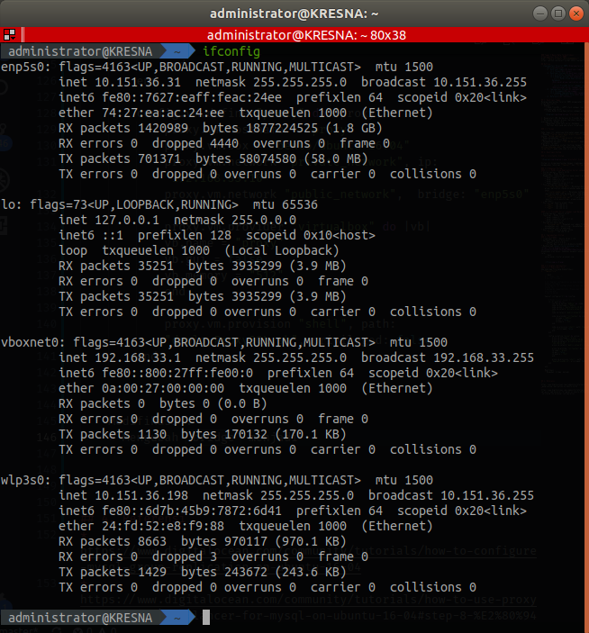

    * Mengurangi `vb.memory` atau memori yang dialokasikan untuk setiap VM, dari 1024 MB menjadi 512 MB
  
2. **Script Provision**
    1.  Script provision untuk host **proxy** **(deployProxySQL.sh)**
        ```bash
        # install proxysql dan mysql
        sudo apt-get update
        cd /tmp
        curl -OL https://github.com/sysown/proxysql/releases/download/v1.4.4/proxysql_1.4.4-ubuntu16_amd64.deb
        curl -OL https://dev.mysql.com/get/Downloads/MySQL-5.7/mysql-common_5.7.23-1ubuntu16.04_amd64.deb
        curl -OL https://dev.mysql.com/get/Downloads/MySQL-5.7/mysql-community-client_5.7.23-1ubuntu16.04_amd64.deb
        curl -OL https://dev.mysql.com/get/Downloads/MySQL-5.7/mysql-client_5.7.23-1ubuntu16.04_amd64.deb
        
        sudo apt-get install libaio1
        sudo apt-get install libmecab2

        sudo dpkg -i proxysql_1.4.4-ubuntu16_amd64.deb
        sudo dpkg -i mysql-common_5.7.23-1ubuntu16.04_amd64.deb
        sudo dpkg -i mysql-community-client_5.7.23-1ubuntu16.04_amd64.deb
        sudo dpkg -i mysql-client_5.7.23-1ubuntu16.04_amd64.deb

        # membuka akses firewall ke 2 port (33061 dan 3306)
        sudo ufw allow 33061
        sudo ufw allow 3306

        # install apache
        sudo apt-get install -y apache2
        sudo systemctl start apache2

        # install php 7.0 dan modul2nya
        sudo apt-get install -y php7.0 libapache2-mod-php7.0 php7.0-mysql php7.0-curl php7.0-mbstring php7.0-gd php7.0-xml php7.0-xmlrpc php7.0-intl php7.0-soap php7.0-zip

        # install wordpress
        cd /tmp
        wget -c http://wordpress.org/latest.tar.gz
        tar -xzvf latest.tar.gz
        sudo mv wordpress/* /var/www/html
        sudo cp /vagrant/wp-config.php /var/www/html/
        sudo chown -R www-data:www-data /var/www/html/
        sudo chmod -R 755 /var/www/html/
        sudo mv /var/www/html/index.html /var/www/html/index.html.bak
        sudo systemctl restart apache2

        # start proxysql
        sudo systemctl start proxysql
        #mysql -u admin -padmin -h 127.0.0.1 -P 6032 < /vagrant/proxysql.sql
        ```
        Modifikasi:
        * Menambahkan script untuk install `Apache`
        * Menambahkan script untuk install `PHP 7.0` dan modul-modulnya
        * Menambahkan script untuk install `Wordpress`
  
    2.  Script provision untuk host **db1** **(deployMySQL11.sh)**
        ```bash
        # install proxysql dan mysql
        sudo apt-get update
        sudo apt-get install libaio1
        sudo apt-get install libmecab2

        curl -OL https://dev.mysql.com/get/Downloads/MySQL-5.7/mysql-common_5.7.23-1ubuntu16.04_amd64.deb
        curl -OL https://dev.mysql.com/get/Downloads/MySQL-5.7/mysql-community-client_5.7.23-1ubuntu16.04_amd64.deb
        curl -OL https://dev.mysql.com/get/Downloads/MySQL-5.7/mysql-client_5.7.23-1ubuntu16.04_amd64.deb
        curl -OL https://dev.mysql.com/get/Downloads/MySQL-5.7/mysql-community-server_5.7.23-1ubuntu16.04_amd64.deb

        # set password mysql
        sudo debconf-set-selections <<< 'mysql-community-server mysql-community-server/root-pass password admin'
        sudo debconf-set-selections <<< 'mysql-community-server mysql-community-server/re-root-pass password admin'

        sudo dpkg -i mysql-common_5.7.23-1ubuntu16.04_amd64.deb
        sudo dpkg -i mysql-community-client_5.7.23-1ubuntu16.04_amd64.deb
        sudo dpkg -i mysql-client_5.7.23-1ubuntu16.04_amd64.deb
        sudo dpkg -i mysql-community-server_5.7.23-1ubuntu16.04_amd64.deb

        # membuka akses firewall ke 2 port (33061 dan 3306)
        sudo ufw allow 33061
        sudo ufw allow 3306

        # copy file konfigurasi untuk mysql
        sudo cp /vagrant/my11.cnf /etc/mysql/my.cnf
        sudo service mysql restart

        # import file sql
        sudo mysql -u root -padmin < /vagrant/cluster_bootstrap.sql
        sudo mysql -u root -padmin < /vagrant/addition_to_sys.sql
        sudo mysql -u root -padmin < /vagrant/create_proxysql_user.sql
        ```
        Tidak ada modifikasi.

    3.  Script provision untuk host **db2** **(deployMySQL12.sh)**
        ```bash
        # install proxysql dan mysql
        sudo apt-get update
        sudo apt-get install libaio1
        sudo apt-get install libmecab2

        curl -OL https://dev.mysql.com/get/Downloads/MySQL-5.7/mysql-common_5.7.23-1ubuntu16.04_amd64.deb
        curl -OL https://dev.mysql.com/get/Downloads/MySQL-5.7/mysql-community-client_5.7.23-1ubuntu16.04_amd64.deb
        curl -OL https://dev.mysql.com/get/Downloads/MySQL-5.7/mysql-client_5.7.23-1ubuntu16.04_amd64.deb
        curl -OL https://dev.mysql.com/get/Downloads/MySQL-5.7/mysql-community-server_5.7.23-1ubuntu16.04_amd64.deb

        # set password mysql
        sudo debconf-set-selections <<< 'mysql-community-server mysql-community-server/root-pass password admin'
        sudo debconf-set-selections <<< 'mysql-community-server mysql-community-server/re-root-pass password admin'

        sudo dpkg -i mysql-common_5.7.23-1ubuntu16.04_amd64.deb
        sudo dpkg -i mysql-community-client_5.7.23-1ubuntu16.04_amd64.deb
        sudo dpkg -i mysql-client_5.7.23-1ubuntu16.04_amd64.deb
        sudo dpkg -i mysql-community-server_5.7.23-1ubuntu16.04_amd64.deb

        # membuka akses firewall ke 2 port (33061 dan 3306)
        sudo ufw allow 33061
        sudo ufw allow 3306

        # copy file konfigurasi untuk mysql
        sudo cp /vagrant/my12.cnf /etc/mysql/my.cnf
        sudo service mysql restart

        # import file sql
        sudo mysql -u root -padmin < /vagrant/cluster_member.sql
        ```
        Tidak ada modifikasi.

    4.  Script provision untuk host **db3** **(deployMySQL13.sh)**
        ```bash
        # install proxysql dan mysql
        sudo apt-get update
        sudo apt-get install libaio1
        sudo apt-get install libmecab2

        curl -OL https://dev.mysql.com/get/Downloads/MySQL-5.7/mysql-common_5.7.23-1ubuntu16.04_amd64.deb
        curl -OL https://dev.mysql.com/get/Downloads/MySQL-5.7/mysql-community-client_5.7.23-1ubuntu16.04_amd64.deb
        curl -OL https://dev.mysql.com/get/Downloads/MySQL-5.7/mysql-client_5.7.23-1ubuntu16.04_amd64.deb
        curl -OL https://dev.mysql.com/get/Downloads/MySQL-5.7/mysql-community-server_5.7.23-1ubuntu16.04_amd64.deb

        # set password mysql
        sudo debconf-set-selections <<< 'mysql-community-server mysql-community-server/root-pass password admin'
        sudo debconf-set-selections <<< 'mysql-community-server mysql-community-server/re-root-pass password admin'

        sudo dpkg -i mysql-common_5.7.23-1ubuntu16.04_amd64.deb
        sudo dpkg -i mysql-community-client_5.7.23-1ubuntu16.04_amd64.deb
        sudo dpkg -i mysql-client_5.7.23-1ubuntu16.04_amd64.deb
        sudo dpkg -i mysql-community-server_5.7.23-1ubuntu16.04_amd64.deb

        # membuka akses firewall ke 2 port (33061 dan 3306)
        sudo ufw allow 33061
        sudo ufw allow 3306

        # copy file konfigurasi untuk mysql
        sudo cp /vagrant/my12.cnf /etc/mysql/my.cnf
        sudo service mysql restart

        # import file sql
        sudo mysql -u root -padmin < /vagrant/cluster_member.sql
        ```
        Tidak ada modifikasi.

3. **File Konfigurasi MySQL**
    1. **my11.cnf**
        ```sql
        #
        # The MySQL database server configuration file.
        #
        # You can copy this to one of:
        # - "/etc/mysql/my.cnf" to set global options,
        # - "~/.my.cnf" to set user-specific options.
        # 
        # One can use all long options that the program supports.
        # Run program with --help to get a list of available options and with
        # --print-defaults to see which it would actually understand and use.
        #
        # For explanations see
        # http://dev.mysql.com/doc/mysql/en/server-system-variables.html

        #
        # * IMPORTANT: Additional settings that can override those from this file!
        #   The files must end with '.cnf', otherwise they'll be ignored.
        #

        !includedir /etc/mysql/conf.d/
        !includedir /etc/mysql/mysql.conf.d/

        [mysqld]

        # General replication settings
        gtid_mode = ON
        enforce_gtid_consistency = ON
        master_info_repository = TABLE
        relay_log_info_repository = TABLE
        binlog_checksum = NONE
        log_slave_updates = ON
        log_bin = binlog
        binlog_format = ROW
        transaction_write_set_extraction = XXHASH64
        loose-group_replication_bootstrap_group = OFF
        loose-group_replication_start_on_boot = ON
        loose-group_replication_ssl_mode = REQUIRED
        loose-group_replication_recovery_use_ssl = 1

        # Shared replication group configuration
        loose-group_replication_group_name = "8f22f846-9922-4139-b2b7-097d185a93cb"
        loose-group_replication_ip_whitelist = "192.168.33.11, 192.168.33.12, 192.168.33.13"
        loose-group_replication_group_seeds = "192.168.33.11:33061, 192.168.33.12:33061, 192.168.33.13:33061"

        # Single or Multi-primary mode? Uncomment these two lines
        # for multi-primary mode, where any host can accept writes
        loose-group_replication_single_primary_mode = OFF
        loose-group_replication_enforce_update_everywhere_checks = ON

        # Host specific replication configuration
        server_id = 11
        bind-address = "192.168.33.11"
        report_host = "192.168.33.11"
        loose-group_replication_local_address = "192.168.33.11:33061"
        ```
        Tidak ada modifikasi.

    2. **my12.cnf**
        ```sql
        #
        # The MySQL database server configuration file.
        #
        # You can copy this to one of:
        # - "/etc/mysql/my.cnf" to set global options,
        # - "~/.my.cnf" to set user-specific options.
        # 
        # One can use all long options that the program supports.
        # Run program with --help to get a list of available options and with
        # --print-defaults to see which it would actually understand and use.
        #
        # For explanations see
        # http://dev.mysql.com/doc/mysql/en/server-system-variables.html

        #
        # * IMPORTANT: Additional settings that can override those from this file!
        #   The files must end with '.cnf', otherwise they'll be ignored.
        #

        !includedir /etc/mysql/conf.d/
        !includedir /etc/mysql/mysql.conf.d/

        [mysqld]

        # General replication settings
        gtid_mode = ON
        enforce_gtid_consistency = ON
        master_info_repository = TABLE
        relay_log_info_repository = TABLE
        binlog_checksum = NONE
        log_slave_updates = ON
        log_bin = binlog
        binlog_format = ROW
        transaction_write_set_extraction = XXHASH64
        loose-group_replication_bootstrap_group = OFF
        loose-group_replication_start_on_boot = ON
        loose-group_replication_ssl_mode = REQUIRED
        loose-group_replication_recovery_use_ssl = 1

        # Shared replication group configuration
        loose-group_replication_group_name = "8f22f846-9922-4139-b2b7-097d185a93cb"
        loose-group_replication_ip_whitelist = "192.168.33.11, 192.168.33.12, 192.168.33.13"
        loose-group_replication_group_seeds = "192.168.33.11:33061, 192.168.33.12:33061, 192.168.33.13:33061"

        # Single or Multi-primary mode? Uncomment these two lines
        # for multi-primary mode, where any host can accept writes
        loose-group_replication_single_primary_mode = OFF
        loose-group_replication_enforce_update_everywhere_checks = ON

        # Host specific replication configuration
        server_id = 12
        bind-address = "192.168.33.12"
        report_host = "192.168.33.12"
        loose-group_replication_local_address = "192.168.33.12:33061"
        ```
        Tidak ada modifikasi.

    3. **my13.cnf**
        ```sql
        #
        # The MySQL database server configuration file.
        #
        # You can copy this to one of:
        # - "/etc/mysql/my.cnf" to set global options,
        # - "~/.my.cnf" to set user-specific options.
        # 
        # One can use all long options that the program supports.
        # Run program with --help to get a list of available options and with
        # --print-defaults to see which it would actually understand and use.
        #
        # For explanations see
        # http://dev.mysql.com/doc/mysql/en/server-system-variables.html

        #
        # * IMPORTANT: Additional settings that can override those from this file!
        #   The files must end with '.cnf', otherwise they'll be ignored.
        #

        !includedir /etc/mysql/conf.d/
        !includedir /etc/mysql/mysql.conf.d/

        [mysqld]

        # General replication settings
        gtid_mode = ON
        enforce_gtid_consistency = ON
        master_info_repository = TABLE
        relay_log_info_repository = TABLE
        binlog_checksum = NONE
        log_slave_updates = ON
        log_bin = binlog
        binlog_format = ROW
        transaction_write_set_extraction = XXHASH64
        loose-group_replication_bootstrap_group = OFF
        loose-group_replication_start_on_boot = ON
        loose-group_replication_ssl_mode = REQUIRED
        loose-group_replication_recovery_use_ssl = 1

        # Shared replication group configuration
        loose-group_replication_group_name = "8f22f846-9922-4139-b2b7-097d185a93cb"
        loose-group_replication_ip_whitelist = "192.168.33.11, 192.168.33.12, 192.168.33.13"
        loose-group_replication_group_seeds = "192.168.33.11:33061, 192.168.33.12:33061, 192.168.33.13:33061"

        # Single or Multi-primary mode? Uncomment these two lines
        # for multi-primary mode, where any host can accept writes
        loose-group_replication_single_primary_mode = OFF
        loose-group_replication_enforce_update_everywhere_checks = ON

        # Host specific replication configuration
        server_id = 13
        bind-address = "192.168.33.13"
        report_host = "192.168.33.13"
        loose-group_replication_local_address = "192.168.33.13:33061"
        ```
        Tidak ada modifikasi.

3. **File SQL**
    1. **cluster_bootstrap.sql**
        ```sql
        -- meminta SSL untuk user replikasi, memberikan user privilage untuk replikasi di server, kemudian mem-flush privilage untuk menerapkan perubahan.
        SET SQL_LOG_BIN=0;
        CREATE USER 'repl'@'%' IDENTIFIED BY 'password' REQUIRE SSL;
        GRANT REPLICATION SLAVE ON *.* TO 'repl'@'%';
        FLUSH PRIVILEGES;
        SET SQL_LOG_BIN=1;

        -- mengatur channel group_replication_recovery untuk menggunakan user replikasi 
        CHANGE MASTER TO MASTER_USER='repl', MASTER_PASSWORD='password' FOR CHANNEL 'group_replication_recovery';
        INSTALL PLUGIN group_replication SONAME 'group_replication.so';

        -- memulai group replication
        SET GLOBAL group_replication_bootstrap_group=ON;
        START GROUP_REPLICATION;
        SET GLOBAL group_replication_bootstrap_group=OFF;

        -- membuat database wordpress
        CREATE DATABASE wordpress;

        -- membuat database playground
        CREATE DATABASE playground;
        CREATE TABLE playground.equipment ( id INT NOT NULL AUTO_INCREMENT, type VARCHAR(50), quant INT, color VARCHAR(25), PRIMARY KEY(id));
        INSERT INTO playground.equipment (type, quant, color) VALUES ("slide", 2, "blue");
        ```
        Modifikasi:
        * Membuat database `wordpress`
  
    2. **cluster_member.sql**
        ```sql
        -- meminta SSL untuk user replikasi, memberikan user privilage untuk replikasi di server, kemudian mem-flush privilage untuk menerapkan perubahan
        SET SQL_LOG_BIN=0;
        CREATE USER 'repl'@'%' IDENTIFIED BY 'password' REQUIRE SSL;
        GRANT REPLICATION SLAVE ON *.* TO 'repl'@'%';
        FLUSH PRIVILEGES;
        SET SQL_LOG_BIN=1;

        -- mengatur channel group_replication_recovery untuk menggunakan user replikasi 
        CHANGE MASTER TO MASTER_USER='repl', MASTER_PASSWORD='password' FOR CHANNEL 'group_replication_recovery';
        INSTALL PLUGIN group_replication SONAME 'group_replication.so';
        ```

    3. **create_proxysql_user.sql**
        ```sql
        -- membuat user monitor
        CREATE USER 'monitor'@'%' IDENTIFIED BY 'monitorpassword';
        GRANT SELECT on sys.* to 'monitor'@'%';
        FLUSH PRIVILEGES;

        -- membuat user playgrounduser
        CREATE USER 'playgrounduser'@'%' IDENTIFIED BY 'playgroundpassword';
        GRANT ALL PRIVILEGES on playground.* to 'playgrounduser'@'%';
        FLUSH PRIVILEGES;

        -- membuat user wordpress
        CREATE USER 'wordpress'@'%' IDENTIFIED BY 'wordpress';
        GRANT ALL PRIVILEGES on wordpress.* to 'wordpress'@'%';
        FLUSH PRIVILEGES;
        ```
        Modifikasi:
        * Membuat user `wordpress`

    4. **addition_to_sys.sql**

4. **wp-config.php**
   ```php
   <?php
    /**
     * The base configuration for WordPress
     *
     * The wp-config.php creation script uses this file during the
     * installation. You don't have to use the web site, you can
     * copy this file to "wp-config.php" and fill in the values.
     *
     * This file contains the following configurations:
     *
     * * MySQL settings
     * * Secret keys
     * * Database table prefix
     * * ABSPATH
     *
     * @link https://codex.wordpress.org/Editing_wp-config.php
     *
     * @package WordPress
     */

    // ** MySQL settings - You can get this info from your web host ** //
    /** The name of the database for WordPress */
    define('DB_NAME', 'wordpress');

    /** MySQL database username */
    define('DB_USER', 'wordpress');

    /** MySQL database password */
    define('DB_PASSWORD', 'wordpress');

    /** MySQL hostname */
    define('DB_HOST', '192.168.33.10:6033');

    /** Database Charset to use in creating database tables. */
    define('DB_CHARSET', 'utf8');

    /** The Database Collate type. Don't change this if in doubt. */
    define('DB_COLLATE', '');

    /**#@+
     * Authentication Unique Keys and Salts.
     *
     * Change these to different unique phrases!
     * You can generate these using the {@link https://api.wordpress.org/secret-key/1.1/salt/ WordPress.org secret-key service}
     * You can change these at any point in time to invalidate all existing cookies. This will force all users to have to log in again.
     *
     * @since 2.6.0
     */
    define('AUTH_KEY',         'put your unique phrase here');
    define('SECURE_AUTH_KEY',  'put your unique phrase here');
    define('LOGGED_IN_KEY',    'put your unique phrase here');
    define('NONCE_KEY',        'put your unique phrase here');
    define('AUTH_SALT',        'put your unique phrase here');
    define('SECURE_AUTH_SALT', 'put your unique phrase here');
    define('LOGGED_IN_SALT',   'put your unique phrase here');
    define('NONCE_SALT',       'put your unique phrase here');

    /**#@-*/

    /**
     * WordPress Database Table prefix.
     *
     * You can have multiple installations in one database if you give each
     * a unique prefix. Only numbers, letters, and underscores please!
     */
    $table_prefix  = 'wp_';

    /**
     * For developers: WordPress debugging mode.
     *
     * Change this to true to enable the display of notices during development.
     * It is strongly recommended that plugin and theme developers use WP_DEBUG
     * in their development environments.
     *
     * For information on other constants that can be used for debugging,
     * visit the Codex.
     *
     * @link https://codex.wordpress.org/Debugging_in_WordPress
     */
    define('WP_DEBUG', false);

    /* That's all, stop editing! Happy blogging. */

    /** Absolute path to the WordPress directory. */
    if ( !defined('ABSPATH') )
        define('ABSPATH', dirname(__FILE__) . '/');

    /** Sets up WordPress vars and included files. */
    require_once(ABSPATH . 'wp-settings.php');
   ```
#### 3.2.2 Menjalankan Vagrant
1. Setelah melakukan modifikasi pada file, maka vagrant virtual box sudah siap dijalankan
    ```bash
    vagrant up
    ```
    Ketika menjalankan vagrant, sebenarnya vagrant sedang melakukan provisioning (persiapan dan konfigurasi) menggunakan semua file di atas. Tunggu selama beberapa menit dan pastikan tidak ada error.
2. Cek apakah vagrant sudah berjalan dengan baik
   ```bash
   vagrant status
   ```

   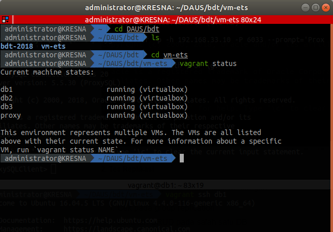

3. Masuk ke VM Proxy
   ```bash
   vagrant ssh proxy
   ```
4. Import file `proxysql.sql` sebagai provisioning tambahan
   ```bash
   mysql -u admin -p -h 127.0.0.1 -P 6032 < /vagrant/proxysql.sql
   ```
   Sebelumnya, `proxysql.sql` dimodifikasi menjadi:
   ```sql
   -- Mengubah user admin ProxySQL
    UPDATE global_variables SET variable_value='admin:password' WHERE variable_name='admin-admin_credentials';
    LOAD ADMIN VARIABLES TO RUNTIME;
    SAVE ADMIN VARIABLES TO DISK;

    -- Menambahkan user 'monitoring'
    UPDATE global_variables SET variable_value='monitor' WHERE variable_name='mysql-monitor_username';
    LOAD MYSQL VARIABLES TO RUNTIME;
    SAVE MYSQL VARIABLES TO DISK;

    -- Menambahkan node MySQL group replication
    INSERT INTO mysql_group_replication_hostgroups (writer_hostgroup, backup_writer_hostgroup, reader_hostgroup, offline_hostgroup, active, max_writers, writer_is_also_reader, max_transactions_behind) VALUES (2, 4, 3, 1, 1, 3, 1, 100);
    INSERT INTO mysql_servers(hostgroup_id, hostname, port) VALUES (2, '192.168.33.11', 3306);
    INSERT INTO mysql_servers(hostgroup_id, hostname, port) VALUES (2, '192.168.33.12', 3306);
    INSERT INTO mysql_servers(hostgroup_id, hostname, port) VALUES (2, '192.168.33.13', 3306);
    LOAD MYSQL SERVERS TO RUNTIME;
    SAVE MYSQL SERVERS TO DISK;

    -- Menambahkan user 'playground'
    INSERT INTO mysql_users(username, password, default_hostgroup) VALUES ('playgrounduser', 'playgroundpassword', 2);
    -- Menambahkan user 'wordpress'
    INSERT INTO mysql_users(username, password, default_hostgroup) VALUES ('wordpress', 'wordpress', 2);
    LOAD MYSQL USERS TO RUNTIME;
    SAVE MYSQL USERS TO DISK;
    ```
    Tujuan dari provision di atas adalah untuk:
    * Mengganti password admin ProxySQL
    * Menambahkan user monitoring
    * Menambahkan node server MySQL
    * Menambahkan user ‘playgrounduser’ sebagai user MySQL biasa yang memiliki database
    `playground`
    
    Modifikasi:
    * Menambahkan user `wordpress`

#### 3.2.3 Konfigurasi Wordpress
1. Mengakses IP ProxySQL pada browser
   ```
   192.168.33.10
   ```
2. Maka akan keluar halaman konfigurasi MySQL
    1. Pilih Bahasa

        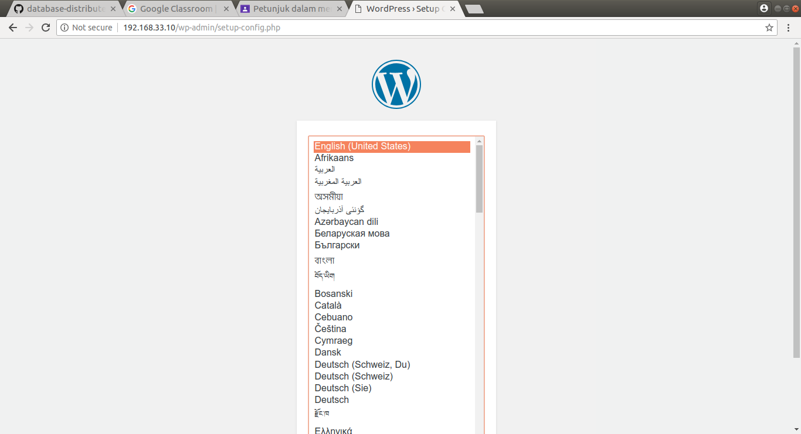

    2. Membuat akun dan membuat judul situs

        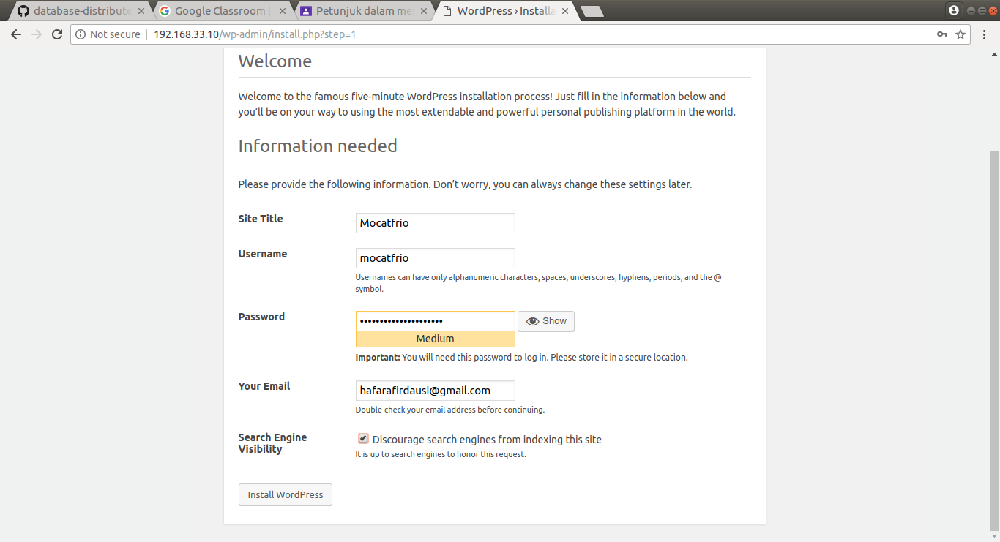

        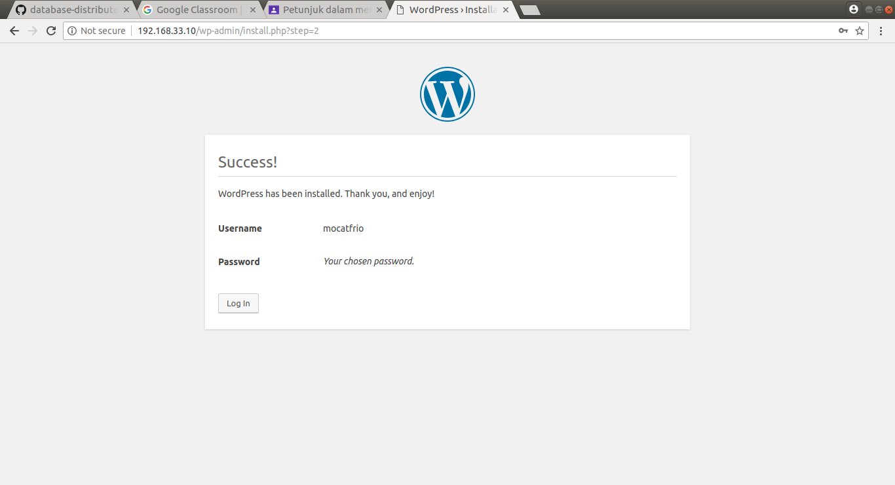

    3. Login

        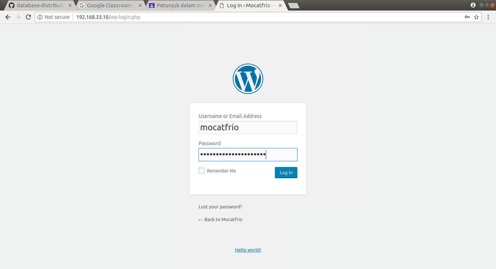

        Masuk ke halaman dashboard

        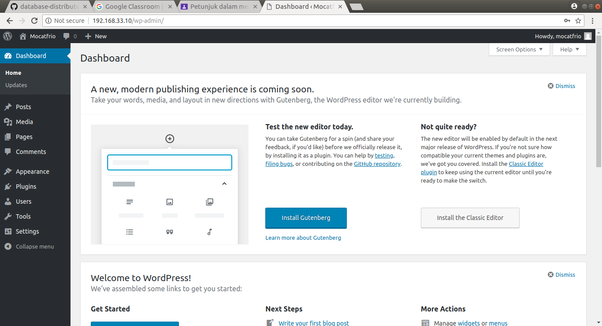

    4. Konfigurasi situs sudah selesai

        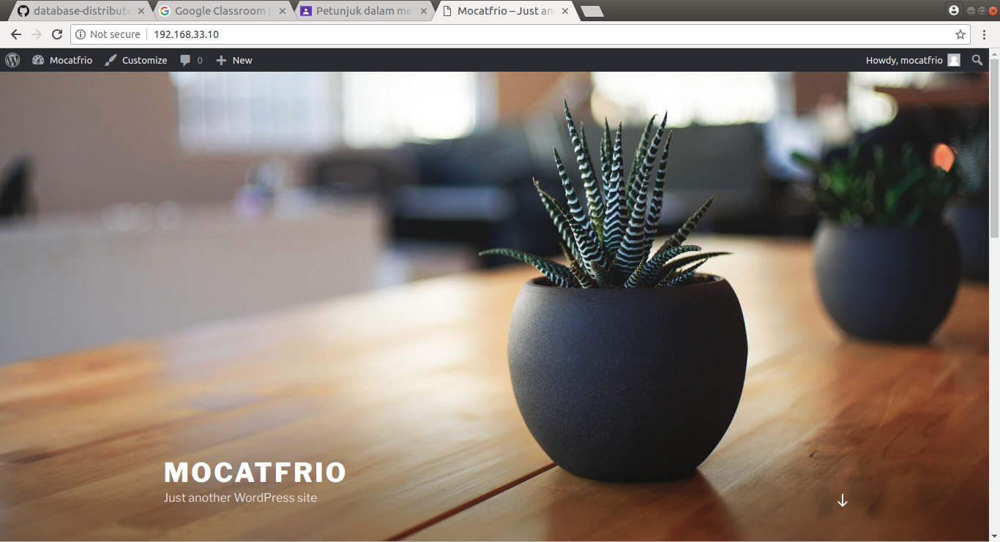

## 4. Testing
### 4.1 Tes Koneksi
1. Melakukan SSH ke semua VM dengan mengetikkan
    ```bash
    vagrant ssh db1
    vagrant ssh db2
    vagrant ssh db3
    vagrant ssh proxy
    ```
    pada terminal yang berbeda

    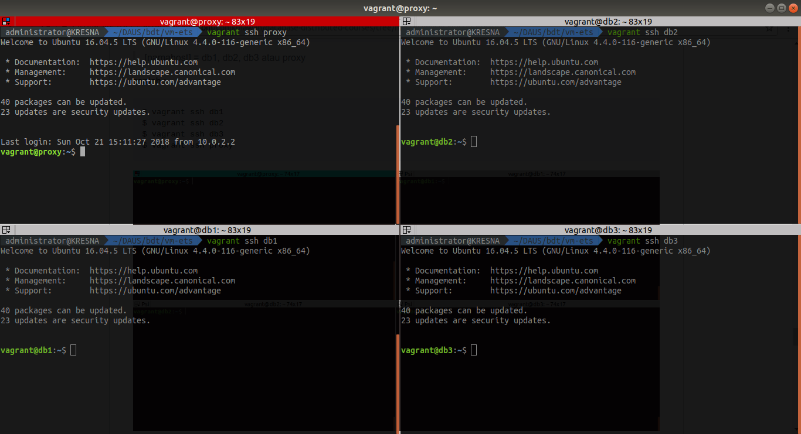

2. Memastikan bahwa user dapat melakukan koneksi ke MySQL Group Replication dari ProxySQL, dengan cara:
   ```sql
   mysql -u playgrounduser -p -h 192.168.33.10 -P 6033 --prompt='ProxySQLClient> '
   ```
   > IP Proxy: 192.168.33.10
   > MySQL port: 6033
   > Username: playgrounduser
   > Password: playgroundpassword
    
    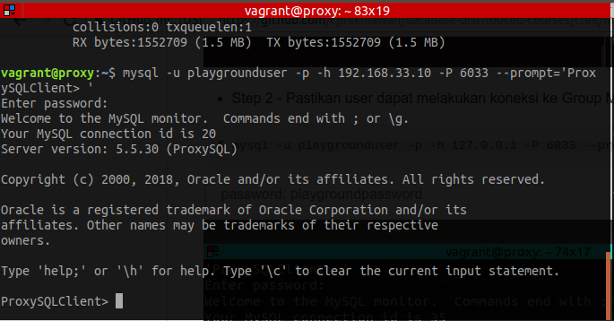


### 4.2 Tes Replikasi dan High Availibility
1. Masuk ke MySQl pada masing-masing VM MySQL Group Replication
    ```sql
    mysql -u root -p admin
    ```
2. Cek tabel wordpress pada semua MySQL Group Replication
   ```sql
   user wordpress;
   show tables;
   ```
    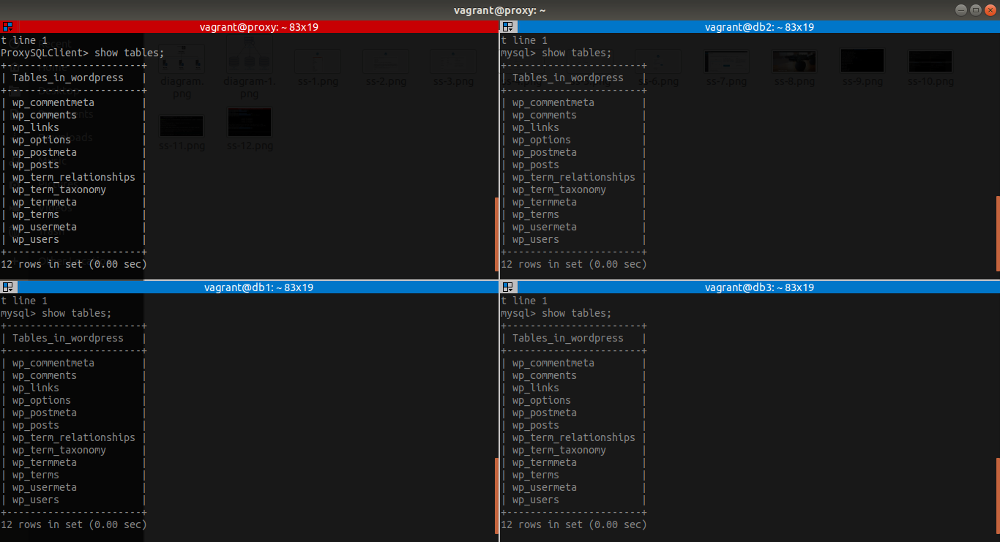

3. Cek isi tabel `wp_users` pada semua MySQL Group Replication. Tabel ini berisi akun wordpress.
   ```sql
   select * from wp_users;
   ```
    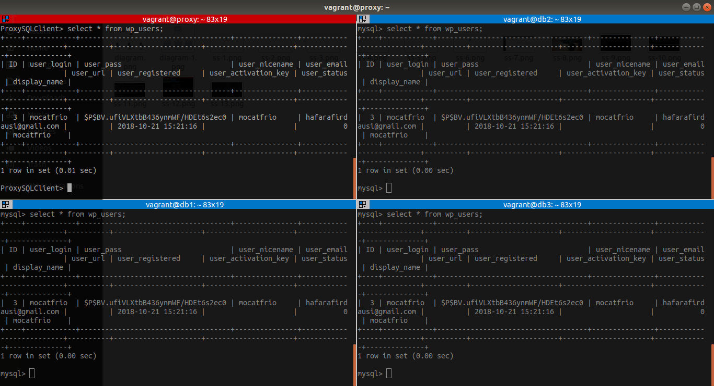

    Pengecekan ini dilakukan sebagai bentuk pengecekan awal apakah database wordpress berhasil tereplikasi dengan baik atau tidak.

4. Testing high availibility server dengan cara mematikan service MySQL salah satu node db, yaitu **db2**.
    ```bash
    vagrant@db2:~$ sudo systemctl stop mysql
    ```
    Kemudian, cek status mysqlnya
    ```bash
    vagrant@db2:~$ sudo systemctl status mysql
    ```
   Cek pula pada **proxy**, node db mana saja yang sedang berjalan atau mati.
    * Masuk ke MySQL
        ```sql
        mysql -u admin -p -h 127.0.0.1 -P 6032 --prompt='ProxySQLAdmin> '
        ```
    * Mengecek `runtime_mysql_servers`
        ```sql
        ProxySQLAdmin> SELECT hostgroup_id, hostname, status FROM runtime_mysql_servers;
        ```
    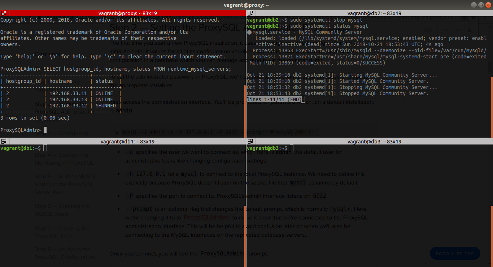

5. Mencoba memposting sesuatu di Wordpress.
   
    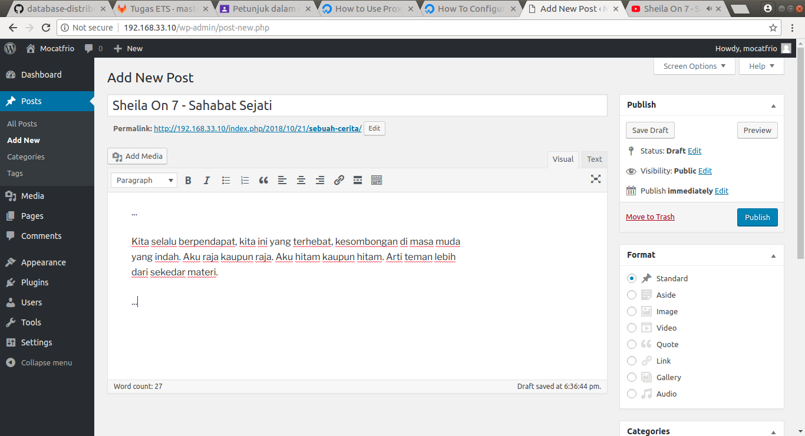

    


6. Menyalakan kembali service MySQL pada **db2** (node yang tadinya mati).
   ```bash
   sudo systemctl start mysql
   ```

7. Mengecek apakah postingan baru di Wordpress berhasil tereplikasi di server db2 yang baru menyala atau tidak.
   * Masuk ke MySQL pada semua node db
    ```sql
    mysql -u root -p admin    
    ```
   * Mengecek isi dari tabel `wp_posts` yakni data postingan di dalam Wordpress pada semua node db
    ```sql
    SELECT * FROM wp_posts\G;
    ```
    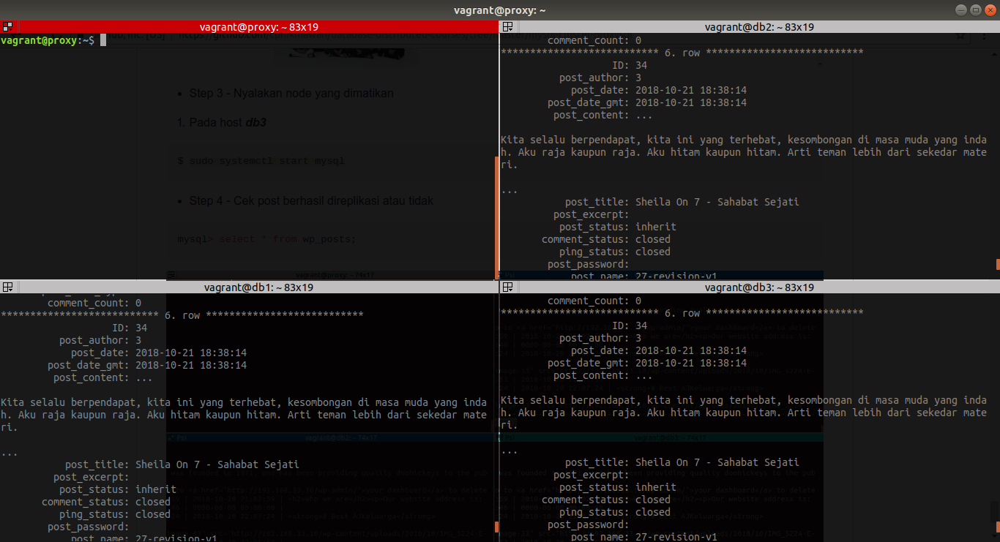

    Postingan baru telah tereplikasi dengan baik pada semua node db, artinya sistem ini telah memenuhi syarat high availibility karena semua data tetap tersinkronisasi walaupun salah satu database mati.

Berikut hasil testing replikasi lainnya.


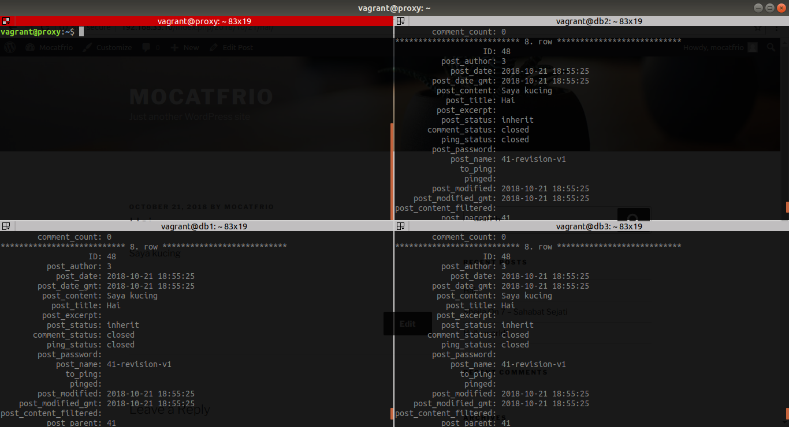

## 5. Referensi
* https://www.digitalocean.com/community/tutorials/how-to-configure-mysql-group-replication-on-ubuntu-16-04
* https://www.digitalocean.com/community/tutorials/how-to-use-proxysql-as-a-load-balancer-for-mysql-on-ubuntu-16-04#step-8-%E2%80%94-verifying-the-proxysql-configuration